# **Chapter 8: Serverless Deployments**

**Abstract**

In this chapter we&#39;ll discuss the serverless deployment options and the different cloud services that we can use to create serverless deployments.

# 7.1 Learning Outcomes
By the end of this chapter the reader should be able to:
- Identify the concept of &#39;Serverless Deployments&#39;.
- Identify the concept of &#39;Serverless Functions&#39;.
- Recognize the &#39;Google Cloud Functions&#39; service.
- Create and deploy serverless functions using GCF.
- Identify the concept of &#39;Serverless Containers&#39;.
- Recognize the &#39;Google Cloud Build&#39; service/tool.
- Recognize the &#39;Google Cloud Run&#39; service/tool.
- Create and deploy &#39;Cloud Run&#39; services.
- Deploy services using &#39;Google App Engine&#39; service

# 8.2 Introduction

We experienced working with server-based deployments in the previous chapters. Despite the great convenience brought to the software industry by using cloud services, you&#39;ve seen that there is still the responsibility of starting and stopping the servers.  We can now understand how wasteful it can be to forget to stop a service when it&#39;s not needed and how problematic it can be to forget to start the server when it&#39;s needed.

The serverless concept was introduced in order to avoid these kinds of problems by leveraging the autonomous nature of cloud services. In the serverless model, the servers are automatically provisioned and started whenever needed and terminated when they&#39;re not.

The term &#39;Serverless&#39; doesn&#39;t indicate that there are no servers altogether; it just indicates that the management of the servers is entirely delegated to the cloud provider.

In this chapter, we&#39;ll see three ways to leverage serverless technology; serverless functions, serverless containers, and serverless apps.

# 8.3 Serverless Functions

Chapter 3 introduced the microservices architecture and how it enhances the modularity and maintainability of the system. The serverless model provides an opportunity to implement the microservices pattern in combination with the event-driven pattern. Other architectural patterns like pipe-filter and asynchronous messaging can be brought to the mix in order to create more sophisticated applications.

Using serverless functions, you can break down your application into small functions (that only need a few minutes to be executed) and tie them with specific events. The resources necessary to execute the function would get started after the triggering event takes place and would keep running during the execution time, then get terminated immediately after the function finishes execution or when the time limit is exceeded.

GCP allows us to create serverless functions using the &#39;Google Cloud Function&#39; service. In the next section, we&#39;ll practice using GCF.

## 8.3.1 GCF through the console

First, we need to enable cloud functions API for the project.

1. Go to the GCP console and Open the side navigation menu.
2. &#39;APIs &amp; Services&#39; to open the sub-menu, then click on &#39;Library&#39;.

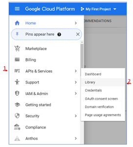

Figure 8.1: GCP APIs and Services

3. In the search box at the top of the page, type &#39;Cloud Functions API&#39;.
4. Click on the first link in the search results, then click &#39;Enable&#39;.
5. We will also need the &#39;Cloud Build API&#39;, so please go ahead and enable it as well.

Now, we can create and deploy our first cloud function.

1. Go back to the navigation menu, scroll down to the &#39;Serverless&#39; category, and click on &#39;Cloud Functions&#39;.

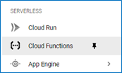

Figure 8.2: GCP Cloud Functions

2. If this is the first function you create, you&#39;ll see a page that looks like the figure below. Click on &#39;CREATE FUNCTION&#39;.

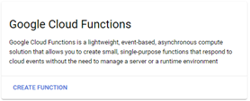

Figure 8.3: First Google Cloud Function

3. The &#39;Create function&#39; dialogue will show up, allowing us to specify the settings for the function we are about to create. As you can see in figure 6.4, there are two main sections we need to configure, the &#39;Basics&#39; and the &#39;Trigger&#39;.

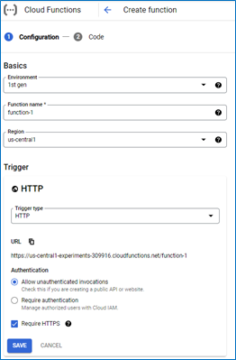

Figure 8.4: Creating a GCF

4. The &#39;Basics&#39; section allows us to specify the name of the function and the region in which we want it to be stored. We&#39;ll leave the default settings for this section.
5. The &#39;Trigger&#39; section is where we specify the trigger type and event that would cause the function to be triggered for execution. In general, trigger types may include different events, and we&#39;d need to specify one of them to trigger the function. However, the HTTP trigger type (the default) has only one event, which is the reception of the HTTP request, so we don&#39;t need to specify it.

   - You can see under the configuration of the &#39;Trigger&#39; the URL that we can use to send that HTTP request. Just like that, a URL is given to us without setting up a web server or any of the steps we&#39;ve gone through in previous chapters.
   - Under the &#39;Authentication&#39; section, we can indicate whether we would like to limit the access to function to specific cloud users. For the sake of this exercise, we&#39;ll check the &#39;Allow unauthenticated invocations&#39;.

6. Click &#39;SAVE&#39; then &#39;NEXT&#39; to go to the code section, as shown in figure 8.5. There are a few things to pay attention to here:

   - First, we can specify the &#39;Runtime&#39; environment, which is by default Node.js 16, but if you click on the little arrow, you&#39;ll see a list of other runtime environments that we can choose from.
   - Second, we can specify the &#39;Entry point&#39;, which is the name of the function to be called to start the execution. As you can see, the source code can actually have multiple functions in multiple modules. So the name &#39;Cloud Function&#39; should not be taken literally. It&#39;s not &#39;one function&#39; that we&#39;ve in the source code. It&#39;s more of a whole (albeit small) functionality that must be finished in a few minutes.
   - Third, we can specify the source code, either by uploading it from a local environment or by writing it in the &#39;Inline Editor&#39;.
   - Finally, the default code that we&#39;re going to use as our first example receives the HTTP request and responds with the value of a parameter called &#39;message&#39; received in the request, either in the body in the case of a POST request or in the query-string in the case o a GET request. If no message was sent with the request, the response would be &#39;Hello World&#39;.

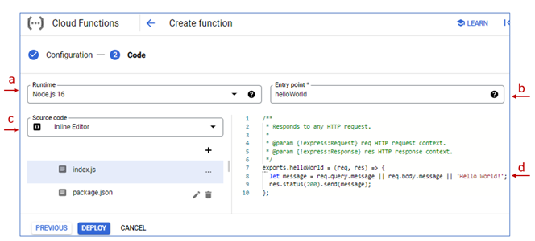

Figure 8.5: GCF Source Code

7. Click &#39;DEPLOY&#39; and give it a few moments to be deployed.
8. Once the deployment is complete, you can see that function-1 is listed under the functions list.


Figure 8.6: function-1 deployed

9. Click on the function&#39;s name to open its details page and click on the &#39;TRIGGER&#39; tab, copy the function&#39;s URL, and past it in the browser&#39;s address bar to see the response.
10. In figure 8.7 below, I sent a &#39;message&#39; parameter to the query string with the value &#39;Testing my first GCF&#39;.

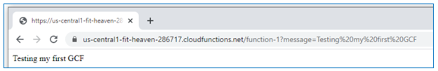

Figure 8.7: Testing the first GCF

## 8.3.2 GCP Cloud Functions through the SDK

The inline editor is a nice feature to test the service. However, it&#39;s not very convenient to use for real development. In this section, we&#39;ll see how to deploy the same sample GCF through the SDK.

1. In the Function details page of &#39;function-1&#39;, go to the &#39;SOURCE&#39; tab then click on &#39;DOWNLOAD ZIP&#39;.

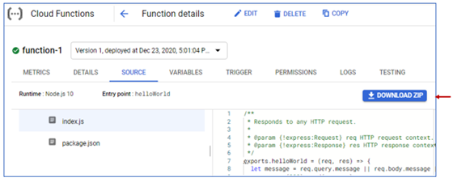

Figure 8.8: Download the sample source code

2. Extract the zip archive after downloading it.
3. Open a terminal and step inside this directory using the cd command.
4. Now we need to know what command we can use for the deployment. As mentioned before, we can find the most recent command syntax by searching the documentation.

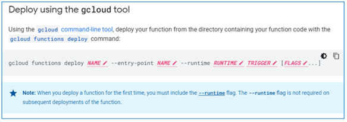

Figure 8.9: Command to deploy a GCF from a local environment

5. Figure 8.9 shows the description of the [gcloud function deploy command](https://cloud.google.com/functions/docs/deploying/filesystem).

   - The first &#39;Name&#39; is the name of the GCF. We&#39;ll give it a different name so that it wouldn&#39;t conflict with function-1 that we created through the console; let&#39;s give it the name &#39;function-1-from-sdk&#39;.
   - The second &#39;Name&#39; is the name of the function called as the entry point; we&#39;ll keep the same entry point, &#39;helloWorld&#39;.
   - We&#39;ll also keep the same runtime, &#39;nodejs16&#39;.
   - The HTTP request trigger type the value for the &#39;TRIGGER&#39; option should be &#39;--trigger-http&#39;
   - To allow unauthenticated access, we&#39;ll use the &#39;--allow-unauthenticated&#39; as a flag.

6. So, the command we need to execute would look like this:
`$ gcloud functions deploy function-1-from-sdk --entry-point helloWorld --runtime nodejs16 --trigger-http --allow-unauthenticated`
7. If the deployment was successful, you should see the output with information about the GCF, including lines similar to the snippet shown in figure 8.10.

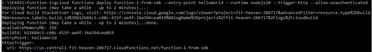

Figure 8.10: GCF Successfully deployed using gcloud tool

8. If you go to the Functions list page on the console, you should be able to see &#39;function-1-from-sdk&#39; listed, and it should work exactly the same way as function-1.

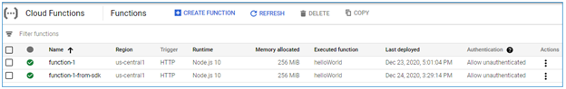

Figure 8.11: function-1-from-sdk listed

## 8.3.3 Creating a mailing-list subscription app

Now that we understand how cloud functions work, let&#39;s try to do something a bit more meaningful. We&#39;ll create a mailing-list subscription app with two microservices implemented as serverless functions with a static webpage as the frontend.

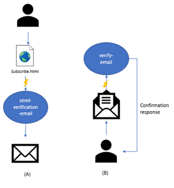

Figure 8.12: Mailing List Subscription App

As you can see in figure 8.12, there are three tiny components of the app. The user would enter their email on the static HTML page and click on a button that would trigger the &#39;send-verification-email&#39; cloud function. The function would then send an email to the submitted address asking the user to click on a link to verify their email, then terminates. At a later time, whenever the user decides to open their email and click on the link, only then the &#39;verify-email&#39; function will be triggered, which sends a confirmation message to the user in the response.

We&#39;ll start the deployment with the verify-email function since it doesn&#39;t depend on any of the other components. Then we&#39;ll deploy the send-verification-email function, and finally, the subscribe.html page.

### The verify-email function

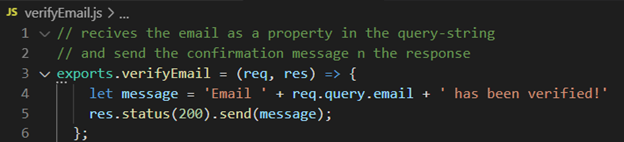

Figure 8.13: Code for the verifyEmail function

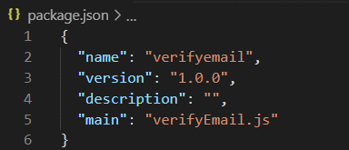

Figure 8.14: package.json for verifyEmail

You may notice that the code is very similar to the sample code we&#39;ve seen in function-1. Only a slight change in the message content and the name of the query-string property and the package.json file is also not very different. The only difference is that, since we&#39;re not using the default name &#39;index.js&#39;, we had to specify the name of the main module that we had in the file &#39;verifyEmail.js&#39;. So the deployment of this function should be pretty similar to the sample function deployment we did in the previous section.

1. Open a command-line terminal and step inside the directory where verifyEmail.js is.
2. Deploy the cloud function using the command:
`> gcloud functions deploy verify-email --entry-point verifyEmail --runtime nodejs16 --trigger-http --allow-unauthenticated`
3. Test the function and make sure it works as expected. In order to do that, you can copy the trigger URL to the address bar of a browser and add a property in the query string with the name &#39;email&#39; and see if the response will come back with the value of the email.

### The send-verification-email function

For the send-verification-email, we need a dependency, namely, [the nodoemailer npm package](https://nodemailer.com/about/). If you want to test the code locally, you&#39;ll need to install the package using the command npm install nodemailer. However, for the cloud function, we don&#39;t have to worry about the actual installation; all we need to do is to have the package name and version included in the dependencies property in the package.json file, as shown in figure 8.15.

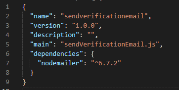

Figure 8.15: package.json file for the sendVerificationEmail function

Sending an actual email would require careful security consideration, which might distract from the focus of this chapter; therefore, we will simulate sending an email using &#39;ethereal.email&#39;. If you are not familiar with JavaScript, don&#39;t worry about understanding the details of the code because the scope of this book is about the deployment, not about the development, so this code will be made available for you.

There are only a few things you need to pay attention to in the code shown in figure 8.16 below.

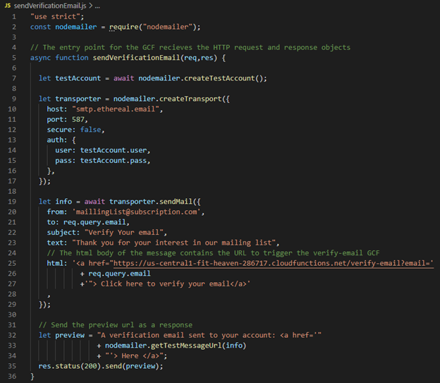

Figure 8.16: Send Verification Email Code

- **Line 5:** shows the definition of the function that would be called automatically as the entry point of the cloud function we are about to create. Since we&#39;ll set up the GCF to be triggered by an HTTP request, when this function is called, the HTTP request and response objects will be sent to it as arguments.
- **Line 25:** In the body of the message, we are sending a hyperlink with the URL of verify-email GCF so that it would be triggered when the user opens their email and clicks on the function.
- **Line 35:** To check the simulated email and click on the verification link, we&#39;ll send the ethereal.email preview URL in the response.

Now that we have the code ready, we can deploy it using the following command.

`> gcloud functions deploy send-verification-email --entry-point sendVerificationEmail --runtime nodejs16 --trigger-http --allow-unauthenticated`

If the deployment was successful, you should be able to see it listed under the Functions list, and you can test it to make sure it works before we move on.

**Note:** If you wanted to make any changes to a function after deploying a function (e.g., fixing bugs), you can just re-deploy it by running the same gcloud functions deploy command.

### The send-verification-email function (Simpler simulation)

Here&#39;s a simpler simulation in which the link to open the email goes to a simulated email message on the same page to avoid working with nodemailer and the ethereal fake SMTP server (since it&#39;s not very reliable, as a free service, we shouldn&#39;t expect too much)

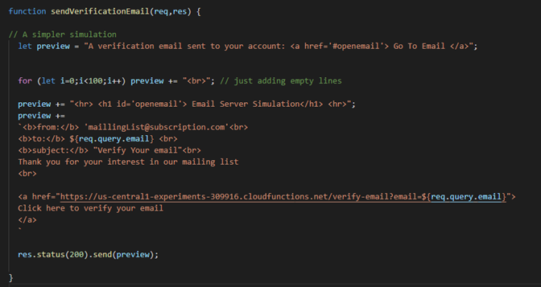

Figure 8.17: (Alternative) Send Verification Email Code

### The subscribe.html webpage


Finally, for the front end, we only need to create a static HTML page that has a form with the action set to the URL of send-verification-email and an input field with the name &#39;email&#39; and a submit button.


Figure 8.18: subsribe.html code

To test the whole application, open the subscribe.html page in a browser, enter an email in the input field, and click on &#39;Subscribe&#39;.

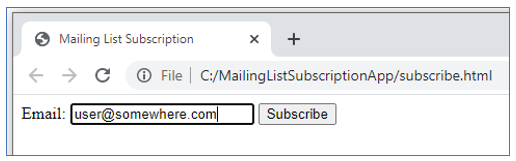

Figure 8.19: Testing - subscribe.html

Clicking on the submission button of an HTML form generates an HTTP request to the URL specified in the action attribute, here the URL to send-verification-email. The request contains the values in the input fields as parameters in the query string. That request triggers the cloud function, which sends the verification email.

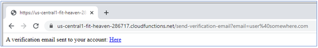

Figure 8.20: send-verification-email triggered

You can open the email message sent by the function by clicking on the link that came in the response.

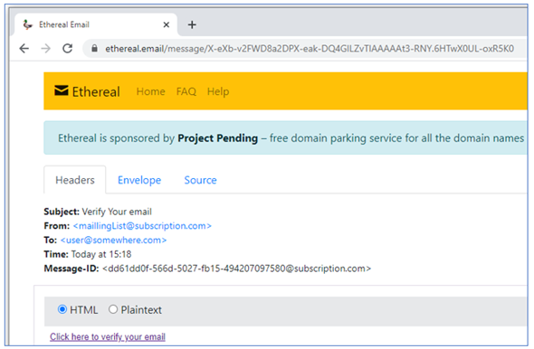

Figure 8.21: Verification Email message

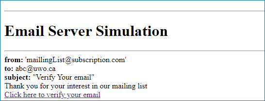

Figure 8.22: Verification Email message in the simpler simulation example

In the body of the message, clicking on the link triggers the verify-email cloud function, which finally sends the message that the email address has been verified.

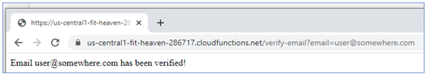

Figure 8.23: verify-email Triggered

## 8.3.4 GCFs Behind the Scenes

### Source code storage

1. Go to GCP&#39;s console and open the navigation menu.
2. Under the &#39;STORAGE&#39; category, click on &#39;Storage&#39;.

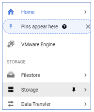

Figure 8.24: Object Storage service in GCP

1. Under the &#39;Storage Browser&#39;, you&#39;ll see a bucket with a name prefixed by &#39;gcf-sources&#39;.

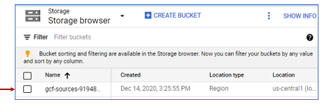

Figure 7.25: Storage bucket for GCF sources

1. Click on that bucket name to see what&#39;s in it. You&#39;ll see a DO\_NOT\_DELETE\_THE\_BUCKET.md file stating that this bucket was automatically generated and that you shouldn&#39;t tamper. Then there&#39;s a folder for each cloud function that contains the source code for this function.

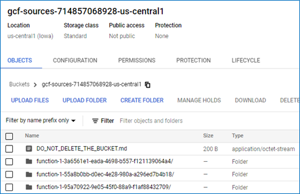

Figure 8.26: Contents of the gcf-sources bucket

### Container Images

1. Go to GCP&#39;s console and open the navigation menu.
2. Under the &#39;Tools&#39; category, click on &#39;Container Registry&#39;.

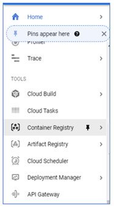

Figure 8.27: GCP&#39;s Container Registry Service

- Under the repositories list, you&#39;ll see a repository named &#39;gcf&#39;. So, behind the scenes, google cloud functions are implemented as containers.

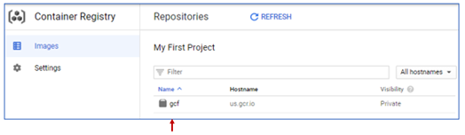

Figure 8.28: gcf repository in the container registry

- If you clicked on the repository name, then the region name, then one of the automatically generated names, you can see that it&#39;s indeed a docker image with the tag based on the name that we specified for the cloud function.

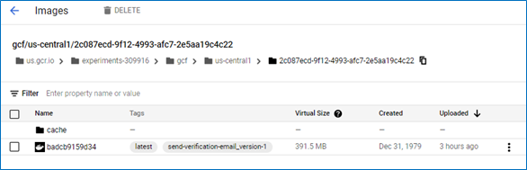

Figure 8.29: send-verification-email version 1 container image

We have the option to create our own container and deploy it in a serverless fashion as well. We&#39;ll see how to do that in the next section.

# 8.4 Serverless Containers

We have seen in chapter 5 how beneficial containerization can be. However, deploying the container on an orchestrator like Kubernetes is still a server-based framework. This means that you, as the developer (or the operations or the DevOps person), would be responsible for the existence and well being of the servers/hosts; even though much of it is automated by Kubernetes, you still have to issue the commands and set the configuration of the automation. In addition to that, the resources may still be wasted because at least some of the servers will have to keep running even when no requests are coming to it. Of course, this cannot be avoided for some applications, and the server-based deployment would be most fitting. However, when this is not the case, there&#39;s a serverless option for deploying containers in GCP, using the &#39;Cloud Run&#39; service.

## 8.4.1 Google Cloud Build

First, let&#39;s explore another service that allows us to build and push a container image to GCP&#39;s containers registry with only one command. We don&#39;t even have to install Docker for it.

In the following steps, I&#39;m going to build the hello-i-am-here image that we discussed in chapter 5 from my local machine, which doesn&#39;t have Docker installed, using Google&#39;s &#39;Cloud Build&#39; service.

- Create a directory named hello-i-am-here and place the three files we created for the app (package.json, index.js, and Dockerfile) in it.
- We need to add one property in the package.json file, which is the &#39;scripts&#39; property, which contains a property to specify the start script. So the package.json file should look like what is shown in figure 8.29.


Figure 8.30: package.json with start script needed by Cloud Run added

- We also need to add another file in the directory with the name &#39;.dockerignore&#39; that should list any files that are not supposed to be included in the image. In this example, we only list two files; the .dockerignore itself and the Dockerfile.

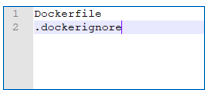

Figure 8.31: The contents of the .dockerignore file

Now that we have the contents ready, we can use the &#39;Cloud Build&#39; service to create the image.

- Make sure the Cloud Build API is enabled for your project.
- Open a command-line terminal and step inside that directory.
- Submit the contents to be used for the container image using the following command

- \&gt; gcloud builds submit --tag gcr.io/ **\&lt;Project-ID\&gt;** /hello-i-am-here
- If you go back to the repositories list, you should be able to see that a repository was created with the Docker image inside of it. 

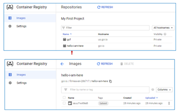

Figure 8.32: hello-i-am-here image created

## 8.4.2 Google Cloud Run

### Exercise: Deploying an application as a single container
Let&#39;s now deploy our &#39;hello-i-am-here&#39; image using google run.
- Go to the service console and open the side navigation menu.
- Under the &#39;SERVERLESS&#39; category, click on &#39;Cloud Run&#39;.

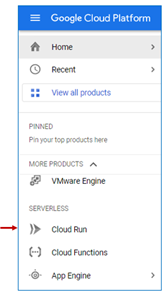
 
 Figure 8.33: GCP Cloud Run service

- On the &#39;Cloud Run Services&#39; page, click on &quot;Create Service&quot;.

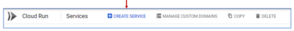
 
 Figure 8.34: Create a Cloud Run Service

- The first option in the &#39;Create Service&#39; form allows us to choose between deploying one revision from an existing image or to continuously deploy new revisions from a repository. For the sake of this exercise, we&#39;ll choose the first option by clicking on the radio button then clicking &#39;SELECT&#39;.

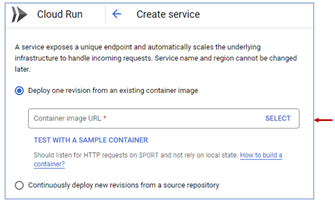

Figure 8.35: Cloud Run Service Deployment settings

- A side menu will show up with the images available for us to choose from. We&#39;ll select the &#39;hello-i-am-here&#39; image that we just created.

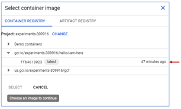

Figure 8.36: Selecting hello-i-am-here image

- Once we select the container image (arrow 1 in figure 8.37) the service name will be populated automatically with the application name (arrow 2 in figure 8.37).
- A nice thing to notice here is the autoscaling configuration (arrow 3 in figure 8.36). As you can see, we can set a minimum and a maximum number of instances. The exact number of instances at a given moment will be determined automatically according to the demand. If we set the minimum to zero, we won&#39;t have to pay any fees for the instances when there&#39;s no demand. However, there&#39;s one disadvantage of this, provisioning the instance and preparing it when the first request comes in takes time, which is called the &#39;cold start&#39;. We can have one instance running all the time to avoid that delay if it matters to our business.

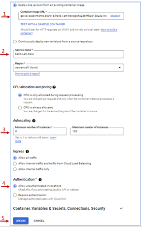

Figure 8.37: Configuring a Cloud Run Service

- Finally, we need to set the authentication to allow unauthenticated invocations then click &#39;CREATE (arrow 4 and 5 in figure 8.37).
- Once the service is created, we should be able to see the trigger URL under the service details, and it runs as expected.

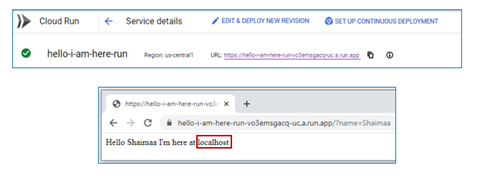

Figure 8.38: Cloud Run service successfully deployed

One thing to notice here, if you remember, when we deployed the services through Kubernetes, the host name that came in the response was the pod automatically generated name, but here it&#39;s just &quot;localhost&quot;. So a &#39;Cloud Run&#39; deployment is not identical to a Kubernetes deployment, and it&#39;s not identical to a serverless function either. It just shares some features with both of them.

### Exercise: Deploying an application with multiple containers

What if we want to deploy an application with multiple components like the mailing list subscription app we created in section 8.3 using &#39;Cloud Run&#39;? In that case, we&#39;ll need to do the following steps for each of the components
1. Create the Dockerfile
2. build and push the image to the registry (or submit it using the &#39;Cloud Build&#39; service)
3. Deploy it using &#39;Cloud Run&#39;.
4. Link the microservices using the URLs created after deployment

Getting to build the container image ourselves means you need to add extra work (i.e. all the steps that were done automatically by GCF); in exchange, we would have more control over how the container is built, and also, there&#39;s no restriction on the execution time.For example, in order to build a container image in which the verifyEmail function would work properly, we&#39;ll need a web server that would receive the HTTP request, pass it on to the application, then receive the response from our application to send it to the user. One way to do that is to create our application as an express server, so the code will have to change a bit.

1. Adjust the verifyEmail microservice to be able to create the container image
   1. Update the code to include a server
  ```
    const express = require('express');
    const server = express();
    server.get('/', (req, res) => 
                  {
                    let message = 'Email ' + req.query.email + ' has been verified!' 
                    res.status(200).send(message);
                  }
            );
    server.listen(8080, '0.0.0.0', () => {console.log('listening on port 8080.');});
  ```

   Listing 8.1: verifyEmail microservice implemented as an express app

   2. Add express to the dependencies and the start script in package.json as in listing 8.2

   ```
      {
        "name": "verifyemail",
        "version": "1.0.0",
        "description": "",
        "main": "verifyEmail.js",
        "scripts": {
          "start": "node verifyEmail.js"
        },
        "dependencies": {
          "express": "^4.17.3"
        }
      }
   ```
   Listing 8.2: package.json file for the verifyEmail microservice

   3. Create the Dockerfile
   ```
    From node:latest
    WORKDIR /usr/src/web-apps/verify-email
    ADD verifyEmail.js .
    ADD package.json .
    RUN npm install
    EXPOSE 8080
    ENTRYPOINT ["node" , "verifyEmail.js"]
   ```
   Listing 8.3: Dockerfile for the verifyEmail microservice

   4. Create .dockerignore file like in figure 8.31
2. Submit the application to cloud build
3. Once the submission is done, we should be able to see the image in the container registry

 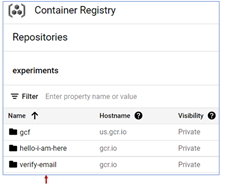

  Figure 8.39: verify-email container image submitted to the Container Registry on GCP

4. Create a service using Cloud Run, test it, and keep the URL to use in the sendVerificaionEmail microservice, as shown in line 16 in listing 8.4.

 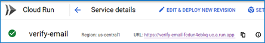

 Figure 8.40: verify-email microservice deployed as a Cloud Run service

  ```
    1.	const nodemailer = require("nodemailer");
    2.	const express = require('express');
    3.	const server = express();
    4.	server.get('/', 
    5.	(req,res) => {
    6.	// A simpler simulation
    7.	let preview = "A verification email sent to your account: <a href='#openemail'> Go To Email </a>";
    8.	for (let i=0;i<100;i++) preview += "<br>"; // just adding empty lines
    9.	preview += "<hr> <h1 id='openemail'> Email Server Simulation</h1> <hr>";
    10.	preview +=
    11.	`<b>from:</b> 'maillingList@subscription.com'<br>
    12.	<b>to:</b> ${req.query.email} <br>
    13.	<b>subject:</b> "Verify Your email"<br> 
    14.	Thank you for your interest in our mailing list
    15.	<br>
    16.	<a href="https://verify-email-fcdun4ebkq-uc.a.run.app?email=${req.query.email}"> 
    17.	Click here to verify your email
    18.	</a>
    19.	`             
    20.	res.status(200).send(preview);
    21.	}
    22.	);
    23.	server.listen(8080, '0.0.0.0', () => {console.log('listening on port 8080.');});
  ```

  Listing 8.4: send sendVerificationEmail microservice implemented as an express app

5. We&#39;ll repeat the same steps to create a Cloud Run service for the sendVerificationEmail microservice, test it and keep the URL to include in the final component, which is the static HTML page representing the front-end of the application as in listing 8.5

 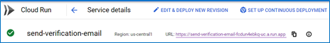

 Figure 8.41: send-verification-email microservice deployed as a Cloud Run service
 
 ```
    <html>
        <head>
            <title>Mailing List Subscription</title>
        </head>
        <body>
            <form action='https://send-verification-email-fcdun4ebkq-uc.a.run.app'>
                Email: <input type="text" name="email">
                <input type="submit" value="Subscribe">
                <hr/>
            </form>
        </body>
    </html>
 ```

 Listing 8.5: The front-end HTML page with the URL to the Cloud Run service as the action

6. Finally, we can test the application starting from the front end. It should work the same way as it did when we deployed the application using GCF.

# 8.5 Serverless Application

Google App Engine is the third service that allows us to create a serverless deployment. It&#39;s very similar to creating the services using Cloud Run, except that we can issue the deployment directly from the development environment without creating the container image or anything related to it. The App Engine will receive the source code, store it (temporarily) in Cloud Storage until it builds the container image then deploy it to create the accessible service.We can only create one application per project; however, the application may contain multiple services that can work either cooperatively with or independently from each other. The services/microservices in the application may even have different environments. If including the services/microservices in the same application is an issue, we&#39;ll just need to create a different project for each application.

### Exercise: Deploying hello-i-am-here app using Google App Engine


1. Preparing the development environment
   1. Step inside the directory that contains the index.js and package.json (with the start script) files representing the hello-i-am-here app.
   2. As mentioned earlier, we don&#39;t need to create the container image ourselves so let&#39;s delete the Dockerfile and .dockerignore files as a clean-up step.
   3. Instead of Dockerfile, we need to create a file called **app.yaml** that includes the configuration we need for the application. We&#39;ll keep it minimal with only one property to specify the runtime environment `runtime: nodejs16`
   4. If we haven&#39;t worked with GCP before, we would have to install the SDK and initialize the environment using the `gcloud init` command to prepare the development environment for the App Engine deployment, but we already have those two steps done, so there is no need to redo them here.
2. Creating the App environment on GCP
   1. Let&#39;s start by creating the App itself using the console. As usual, we start at the navigation menu, then under the &#39;SERVERLESS&#39; category, click on &#39;App Engine&#39;.

   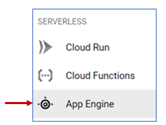

   Figure 8.42: Serverless App Engine service

   2. If we didn&#39;t create the application for the project already, we&#39;d be greeted with a welcome message and a button to create the application.
   
   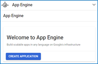

   3. Then it will ask us to choose a region and a service account, which we can keep both as default.
   
   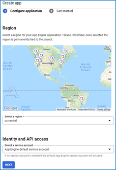

   4. We&#39;ll then be directed to choose the language and the environment. We&#39;ll choose Node.js since it&#39;s what we need for our service, and we&#39;ll leave the default &#39;Standard&#39; environment.

   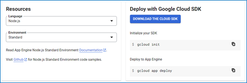

   5. The right-side section gives us instructions on how to deploy the application. We already have the first two steps done; we just need to execute the third step to deploy the service.

3. Deploy the service from the development environment to the App Engine
   1. Open a terminal from inside the &#39;hello-i-am-here&#39; directory
   2. Issue the command `gcloud app deploy`, then type &#39;y&#39; to continue

    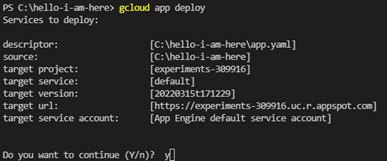
   
   3. Once the deployment is done, we can go to the services tab to see that we just created the default service for the app.

   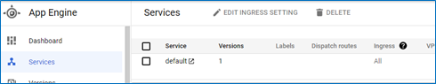

   4. Click on the name of the service to send an HTTP request to its URL that you can see in the address bar in the figure below. The response comes as expected.

   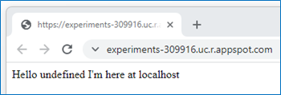

   5. What if we want to create a new version of the application to fix this &quot;undefined&quot; bug? We&#39;ll we just need to change the code in the development environment and issue the gcloud app deploy command again
   6. After the deployment is done, we can refresh the services page to see that the version number is now 2.

   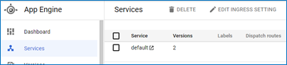

   7. And the response comes without the &#39;undefined&#39; bug.

   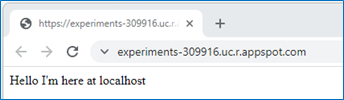

4. We can also see the two versions of the container image under the container registry service.
  
   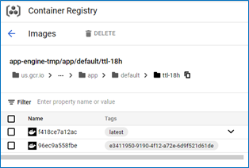
   
See if you can deploy the email subscription app with its two microservices using App Engine.

# 8.6 Summary

In this chapter, we discussed serverless deployment options. We practiced using two of the serverless services on GCP, namely, &#39;Google Cloud Functions&#39;, which allows us to create serverless functions, &#39;Google Run&#39;, which allows us to create serverless containers deployments, and &#39;App engine&#39; which allows us to create complete applications in a serverless fashion. In addition to that, we also practiced working with the Cloud Build service, which allows us to build and submit/push Docker containers to GCP&#39;s containers register.

# Image Credits

[GCP Screenshots] &quot;Google and the Google logo are registered trademarks of Google LLC, used with permission.&quot;Unless otherwise stated, all images in this chapter were created by the author Shaimaa Ali using either MS PowerPoint or MS Visio or both. Code screenshot made using MS VSCode.

© Shaimaa Ali 2022