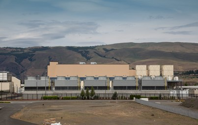
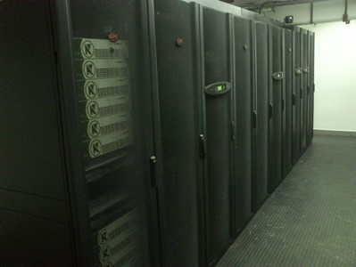
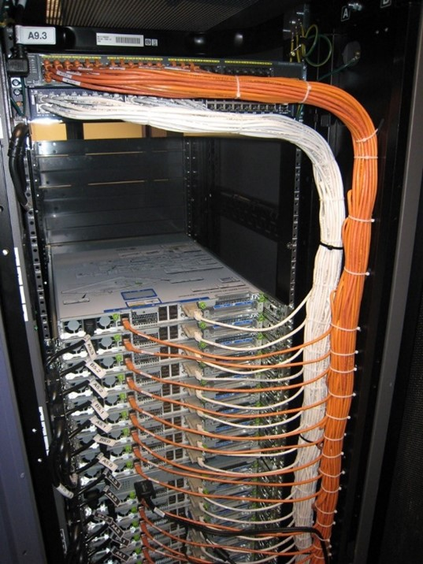
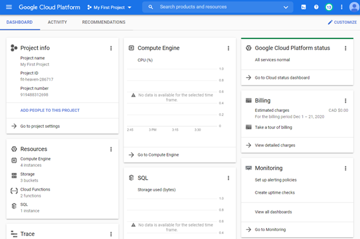

# **Chapter 01 - Introduction**
# 1.1 Learning Outcomes
By the end of this chapter, the reader should be able to:
- Identify the concept of cloud computing.
- Identify the standard service models.
- Identify the standard deployment models.
- Recognize the essential characteristics of a cloud service.
- Recognize the benefit of cloud computing.
- Recognize the main public service providers.
- Access the Google Cloud Platform using the console, the SDK, and the client API.

# 1.2 What is Cloud Computing?

The term cloud may seem elusive or intangible; however, this is far from what it refers to in the technical sense. If we were to borrow anything from the real cloud that resembles the technical cloud, it would be the agility and flexibility of moving around and changing shapes effortlessly.

The technical cloud refers to a software layer built on top of the well-known concept of data-centers that large enterprises have used for a long time. A data-center is a central location where the computers and networking devices are kept and maintained.

**Figure 1.1: Google Data Center - The Dalles, Oregon [1]**

**Figure 1.2: Inside a data center [2]**

**Figure 1.3: A Rack [3]**

What turns a traditional data center into a cloud infrastructure is a set of logical workflows that allow users of the data-center seamless access to computing and networking powers without having to worry about the technical specifics of the actual infrastructure.

The whole concept started at Amazon when they were addressing their needs for mechanisms to facilitate the flexibility and scalability demanded by their eCommerce business and allow them to offer their infrastructure and those newly created mechanisms as a service for their partners and latter for the public. In that, Amazon became the first public cloud provider, other companies followed that path and started to offer access to their infrastructure as well.

Public providers may have several data-centers in different geographical locations known as _ **regions** _. Within a region, isolated _ **zones** _ with resources close to each other allow for more efficient connectivity.

## 1.2.1 Standard Definition

The national institute of standards and technology ([NIST](https://nvlpubs.nist.gov/nistpubs/Legacy/SP/nistspecialpublication800-145.pdf)) defines cloud computing as follows:

> Cloud computing is a model for enabling ubiquitous, convenient, on-demand network access to a shared pool of configurable computing resources (e.g., networks, servers, storage, applications, and services) that can be rapidly provisioned and released with minimal management effort or service provider interaction.

NIST also specifies five essential characteristics, three service models, and four deployment models. All these components are discussed below.

# 1.3 Service Models

To help you understand the difference between the service models, let&#39;s start with an example that follows the traditional (non-cloud-based) approach. Let&#39;s say you started a software development company. First, you would need to buy some computers, storage devices, and network devices to create _&quot;infrastructure&quot;_ for your company. Then you need to create the _&quot;platform&quot;_ by installing the development environment, including the language SDKs, the IDEs, the source management systems, frameworks, the DBMS ..etc. Finally, the product you created is a _&quot;software&quot;_ product that you need to make available to your clients (i.e., the end-users).

The three cloud service models allow you to delegate any of these three levels to the cloud provider in exchange for a fee.  Namely, the standard service models are Infrastructure as a Service (_IaaS_), Platform as a Service (_PaaS_), and Software as a Service (_SaaS_).

You may have heard of or read about the terms CaaS (Container as a Service) and FaaS (Function as a Service).  They are referenced this way because they provide additional levels of delegation of responsibilities to the service provider; however, they are not standard service models. We will talk about them in more detail later.

### 1.3.1 Infrastructure as a Service (IaaS)

The Infrastructure as a Service model allows you to access the infrastructure owned by the cloud provider and avoid the upfront cost of acquiring the actual devices. More specifically, you would have access to a portion of the physical servers that appear to be a separate machine through the virtualization mechanism. You have the freedom to create your platform on this infrastructure. The provider is responsible for maintaining and securing the infrastructure, while you would be responsible for maintaining and securing your platform.

Accessing infrastructure as a service generally includes accessing storage space, computing power, and network connectivity.

### 1.3.2 Platform as a Service (PaaS)

Using the Platform as a Service (PaaS) model, commonly used platforms (e.g., DBMSs and language SDKs) can be accessed as a service and, therefore, save you the hassle of maintaining them. In that case, you would be renting the platform on top of the needed infrastructure. Examples include Google App Engine and GitHub.

### 1.3.3 Software as a Service (SaaS)

After you create your software, you can provide it as a service through the cloud and allow the end-users to access it directly using a thin client or a browser. If you are the end-user of this software, you wouldn&#39;t be responsible for any maintenance; you just enjoy using the service. Examples include Dropbox and Netflix.

# 1.4 Deployment Models

Several deployment models determine who operates or has access to the cloud.

### 1.4.1 Public Cloud

In the public cloud model, a &quot;cloud provider&quot; owns and maintains the cloud and offers services to access it to the general public, including individuals and businesses. The cloud resources are shared among all users, which often raises security concerns. However, it&#39;s the provider&#39;s responsibility to implement protective mechanisms to address these concerns. How much are they successful in that? The answer is still debatable to this day. That&#39;s why it&#39;s not recommended for highly sensitive applications to use public clouds.  The main advantage of the public model is that it provides immediate access to a sophisticated infrastructure without needing the required technical expertise or paying upfront fees. For example, Dropbox used to use AWS services when they first started, then decided to have their own private cloud after they became capable of managing it.

### 1.4.2 Private Cloud

In the private model, the cloud infrastructure is exclusive to a specific organization, making it suitable for organizations with highly sensitive data and enough funding. If the organization can acquire and manage the technical expertise, they can have their cloud internally; otherwise, a third party can manage it.

### 1.4.3 Community Cloud

Several organizations with the same policy and compliance considerations can share the cost of creating a shared cloud with shared data and applications accessible only to contributing organizations.

### 1.4.4 Hybrid Cloud

The hybrid model combines the best of both worlds. In this case, an organization may have a private cloud for their sensitive data and applications according to the level of expertise they can manage in combination with some services on a public cloud for the less sensitive aspects of their business.

# 1.5 Essential Characteristics

In this section, we&#39;ll review the five essential characteristics of a cloud service specified by [(NIST)](https://nvlpubs.nist.gov/nistpubs/Legacy/SP/nistspecialpublication800-145.pdf) in order to understand what is expected from a service provider.

### 1.5.1 On-demand self-service

> A consumer can unilaterally provision computing capabilities, such as server time and network storage, as needed automatically without requiring human interaction with each service provider.

The cloud provider needs to establish mechanisms that allow the clients to decide on the levels, types, and amounts of services they would like to have and get access to these services immediately and automatically without having to go through customer service or lengthy bureaucratic procedures.

### 1.5.2 Broad network access

> Capabilities are available over the network and accessed through standard mechanisms that promote use by heterogeneous thin or thick client platforms (e.g., mobile phones, tablets, laptops, and workstations).

The provider needs to establish mechanisms that allow the clients easy access to their services through a network using different devices.

### 1.5.3 Resource pooling

> The provider&#39;s computing resources are pooled to serve multiple consumers using a multi-tenant model, with different physical and virtual resources dynamically assigned and reassigned according to consumer demand. There is a sense of location independence in that the customer generally has no control or knowledge over the exact location of the provided resources but may be able to specify location at a higher level of abstraction (e.g., country, state, or data-center).

The provider needs to establish mechanisms that allow their resources to be shared by multiple clients, with the flexibility to de-allocate, re-allocate or add resources dynamically and seamlessly without interrupting the service or having the client worry about the specifics of the physical resources except on a very high-level to accommodate for political or regulatory needs. For example, governmental organizations would likely choose not to have their data stored in a data-center located in another country as that data center might have to abide by the other country&#39;s laws, which may jeopardize the privacy of the sensitive documents or data.

### 1.5.4 Rapid elasticity

> Capabilities can be elastically provisioned and released, in some cases automatically, to scale rapidly outward and inward commensurate with demand. To the consumer, the capabilities available for provisioning often appear to be unlimited and can be appropriated in any quantity at any time.

The provider needs to provide mechanisms that allow the resources to scale up and down according to their dynamic needs. In other words, if a particular resource remains idle or under-utilized for a given time, the client doesn&#39;t need to occupy and pay for that resource. It&#39;s more beneficial that the resource is re-allocated to another client&#39;s service experiencing a delay or high demand, and that process should be seamless to both customers.

### 1.5.5 Measured service

> Cloud systems automatically control and optimize resource use by leveraging a metering capability at some level of abstraction appropriate to the type of service (e.g., storage, processing, bandwidth, and active user accounts). Resource usage can be monitored, controlled, and reported, providing transparency for both the provider and consumer of the utilized service.

The provider needs to establish mechanisms to automatically measure and report the usage of the resources for the sake of billing and dynamic scalability.

# 1.6 Cloud value propositions

The following are the main value propositions that contributed to the vast popularity of adapting cloud services nowadays.

###  1.6.1 Cost Efficiency

Using cloud services and technologies reduces the cost in the following ways.

- Lower acquisition cost: Cloud technologies can help reduce or eliminate the infrastructure acquisition cost. In the case of using a public cloud service, the acquisition cost would be removed and replaced by an operational cost in a pay-per-use model. Even in the case of a private cloud in which the business chooses to own on-premise infrastructure, cloud technologies allow for better utilization, therefore, reducing the number of servers needed and reducing the overall acquisition cost.
- Better Utilization: Consider, for example, an organization that has three physical servers: web-server, application-server, and file-server. Not all of these servers deal with the same amount of load simultaneously. So, having a physical server dedicated to a specific service can lead to a waste of resources. One of the advantages of using cloud technologies is seamlessly balancing the load among the physical servers to enhance utilization.
- Dynamic Scalability: Cloud technologies allow allocating and de-allocating resources according to the demand, therefore, avoiding wasting resources for over-scaling or losing business for under-scaling.

### 1.6.2 Productivity

Using cloud services enhances productivity in two ways; the flexibility of accessing the resources and the reduced maintenance headache.

- Flexibility: Consider a cloud service like Dropbox, for example. The service allows you to store your data on the cloud and access it from anywhere through client software or simply through the browser so that you are not tied to a specific device or a place to access the resources you need. This particular value became very prominent due to the Covid-19 pandemic that forced many businesses to switch to the &quot;work from home&quot; model. Those businesses that were already on the cloud wasted no time for the switch. Others were forced to transition to the cloud as quickly as possible or suffered severe losses because their offices were closed.
- Reduced maintenance headache: Even if the cost was not an issue for a large organization, the maintenance of hardware and software technologies could be a burden of its own, especially with the fast pace of change in the industry. By using cloud services, organizations can delegate this burden to the cloud provider and save their resources to focus on developing their products and, therefore, enhance their productivity.

### 1.6.3 Quality

Having the latest technologies at your fingertips, in addition to educational resources on how to make the best of them, allows for better quality for both the development process as well as the end product.

### 1.6.4 Speed of Delivery

The elimination of the need for the planning, procurement, and logistics of infrastructure and possibly platforms made the cloud services most suitable for organizations that need to minimize the development time and maximize delivery speed. This is especially true for startups that need to be in the market, generating income as soon as possible.

### 1.6.5 Security

You might wonder why we list security as one of the value propositions of cloud computing, given the ongoing concerns that made several businesses reluctant to trust any cloud provider with their data or applications. Perhaps we can use the [CapitalOne Data Breach](https://www.cnn.com/2019/07/29/business/capital-one-data-breach/index.html) incident that made headlines in 2019 as an example to understand how &quot;better security&quot; is one of the cloud value propositions. Here is a list of events and lessons we can learn from them.

| Event | **Lessons** |
| --- | --- |
| A hacker hacked into a server hosting the personal data of CapitalOne customers and posted it on social media and GitHub. Someone saw the post on GitHub and informed CaptialOne, which told the FBI, and an investigation started. This hacker was then identified and arrested for the breach. | Perhaps the main lesson to be learned here is (although a bit irrelevant) to think twice before you do something that would end up ruining your entire career just because you just wanted to have an ego boost. |
| Senator Ron Wyden wrote a letter to Amazon&#39;s CEO, questioning whether Amazon was to be held responsible for the breach and whether other AWS clients would be at risk of a similar attack.[Senator Ron Wyden&#39;s letter to Amazon&#39;s CEO ](https://www.wyden.senate.gov/imo/media/doc/080519%20Letter%20to%20Amazon%20re%20Capital%20One%20Hack.pdf) | Here we can see a significant benefit of using a public service provider: they are subject to be questioned and held accountable by public representatives, which is an important motivator for companies or any service providers. |
| Amazon responded in a letter asserting that the breach mainly happened because of a firewall misconfiguration set by CapitalOne. They also stated that they do offer documentation and how-to guides and services like (AWS Web Application Firewall) to help their clients reach higher levels of security.[Amazon&#39;s Response to Senator Wyden](https://www.wyden.senate.gov/imo/media/doc/081319%20Amazon%20Letter%20to%20Sen%20Wyden%20RE%20Consumer%20Data.pdf) | Here we can learn two important lessons. Being a service provider means that you&#39;d have dedicated teams that work on making sure your services are up-to-date and provide training and documentation for your clients. The other important issue here is the concept of &quot;shared responsibility&quot;. The service provider can offer the service, but in some cases, it&#39;s the client&#39;s responsibility to turn it on or to configure it properly. Hence, as a client, it&#39;s imperative to pay attention to what exactly is your responsibility and how to make sure that you are doing your part. |
| The senator later sent a letter to the Federal Trade Commission (FTC) to open an investigation into Amazon&#39;s responsibility in the incident, given that the company didn&#39;t adopt security defenses adopted by its competitors Google and Microsoft.[FTC Investigation Letter](https://www.wyden.senate.gov/imo/media/doc/102419%20Wyden%20Warren%20Letter%20to%20FTC%20RE%20Amazon%20Capital%20One%20Hack.pdf) | Here is another benefit of public service providers; the competition. The availability of multiple providers means that a client has various options to choose the best fit for their needs and motivate the providers to enhance their services. |

**Table 1.1**

# 1.7 Main public providers

As mentioned before, the whole concept started at Amazon with AWS. Seeing the popularity and profitability of the model, other big and small tech companies began to join the field. Table 1.2 below shows the percentage of market shares of the major service providers in the first three quarters of the year 2021. ([click here to see more data and visualization](https://www.statista.com/statistics/967365/worldwide-cloud-infrastructure-services-market-share-vendor/))

| **Service Provider** | **2021 Q1** | **2021 Q2** | **2021 Q3** |
| --- | --- | --- | --- |
| Amazon Web services (AWS) | 32% | 31% | 32% |
| Microsoft Azure | 19% | 22% | 21% |
| Google Cloud Platform (GCP) | 7% | 8% | 8% |
| Others | 42% | 39% | 39% |

**Table 1.2**

You can see there are several players in the field, and AWS still has the lead. However, GCP was chosen for this course because of its suitability for introductory material and educational resources

It is important to realize that it is trending that businesses would leverage multiple providers (i.e., combining different services from different providers) to maximize their benefit. So, being able to work with the services available by the other providers is essential to be successful in the field. Also, just like other companies learned from Amazon to create their own offerings, all the providers continue to monitor each other and adapt successful technologies developed by their competitors to maintain their place; for example, Kubernetes was developed at Google, and now adopted by the other providers.  So, being able to learn new technologies and transfer your knowledge among different providers would contribute to your success.

# 1.8 Getting Started

In this section, you&#39;ll start your first hands-on experience with the google cloud platform (GCP), in which you&#39;ll prepare for the three ways of accessing cloud services; the web console, the command-line, and programmatically.

### 1.8.1 Create a Google Cloud Account

1. Go to: [https://cloud.google.com](https://cloud.google.com/)
2. Click on &quot;Get Started for free&quot; button

**Figure 1.4: Get started button**

1. Complete the sign-up process

Please note that A google account will be needed to create this cloud account; you can use an existing account (e.g., Gmail account) or create a new one [here](https://accounts.google.com/signup/v2/webcreateaccount?service=cloudconsole&amp;continue=https%3A%2F%2Fconsole.cloud.google.com%2Ffreetrial%3F_ga%3D2.7638773.632595472.1598990609-1747982746.1597692525%26ref%3Dhttps%3A%2F%2Fcloud.google.com%2F&amp;gmb=exp&amp;biz=false&amp;flowName=GlifWebSignIn&amp;flowEntry=SignUp&amp;nogm=true).

### 1.8.2 The Console

After creating the account and logging in, click on the &quot;Go to console&quot; button.

**Figure 1.5: Go to console button**

The console is like the home page for your account that allows you to see an overview of your account and navigate through it. The console page has three tabs: Dashboard, Activities, and Recommendations. The content of the Dashboard page is organized in &quot;Cards&quot; some of the available cards are displayed by default when you first create your account. You can hide a displayed card by clicking on the &quot;Hide Card&quot; option in the menu that appears by clicking on the three vertical dots button on the top right corner of each card. You can add cards or customize the dashboard by clicking on the &quot;customize&quot; link in the top-right corner of the page.

**Figure 1.6: GCP Dashboard**

 Google organizes the resources you requested into isolated projects for the sake of security and billing management. So, all resources or services required under a specific project will be charged on the account associated with that project regardless of the user requesting it. You can add people to your project by clicking on the &quot;Add people to your project&quot; link on the project&#39;s card.

When you first create an account, a new project is created automatically with the name &quot;My First Project&quot;. You can change the project&#39;s name by clicking on &quot;Go to project settings&quot; and changing the value stored under the &quot;Project Name&quot;. You can change the active project or create new ones by clicking on the small triangle arrow beside the project&#39;s name in the header bar.

### 1.8.3 The Cloud SDK

The console described in the previous section allows you to access the cloud service through a web interface. In addition to that, you can access the same services through the command line or from within your code. In this section, you&#39;ll prepare your environment for more sophisticated access to the cloud services by installing the google cloud SDK.

1. [Install Python 3.8](https://www.python.org/downloads/) (or higher) and make sure that the PATH environment variable includes the path to your installation
2. Go to [https://cloud.google.com/sdk/](https://cloud.google.com/sdk/)
3. Click on the &quot;Try it free&quot; button
4. Follow the instructions in the &quot;Quickstart&quot; document for your platform

### 1.8.4 Prepare for programmatic access

In this book, we&#39;ll practice accessing cloud resources programmatically through JavaScript running in Node.js. The steps below are needed to prepare for this type of access.

1. [Download and install Node.js](https://nodejs.org/en/download/)
2. Open a command line and type node --version to ensure that it was installed properly.
3. Allow programmatic access to your cloud resources

- In the previous section, you executed the command gcloud auth login in one of the steps, which allows you to authenticate the execution of command-line instruction under your account&#39;s credentials.
- In order to allow a piece of code to access the cloud resources programmatically under your credentials, you need to run the same command with the &quot;application-default&quot; option as shown below and follow the same steps you did in the previous section.

 `> gcloud auth application-default login`

# 1.9 Summary

In this chapter, we introduced the concept of cloud computing and how it came about. We also reviewed the standard definition of cloud computing by the [National Institute of Standards and Technology (NIST)](https://nvlpubs.nist.gov/nistpubs/Legacy/SP/nistspecialpublication800-145.pdf). We also discussed the value propositions of cloud services and what caused the rising cloud adoption trends. Finally, we had the first glimpse at Google Cloud Platform (GCP) and prepared the environments for the hands-on exercises in the coming chapters.

# Image Credits

[1] [&quot;Google Data Center - The Dalles, Oregon&quot;](https://www.flickr.com/photos/87296837@N00/17832143871) by [Tony Webster](https://www.flickr.com/photos/87296837@N00) is licensed under [CC BY 2.0](https://creativecommons.org/licenses/by/2.0/?ref=ccsearch&amp;atype=rich)

[2][&quot;Datacenter informatique de l&#39;Ecole Polytechnique&quot;](https://www.flickr.com/photos/117994717@N06/33231397631) by [Ecole polytechnique / Paris / France](https://www.flickr.com/photos/117994717@N06) is licensed under [CC BY-SA 2.0](https://creativecommons.org/licenses/by-sa/2.0/?ref=ccsearch&amp;atype=rich)

[3][&quot;Wiring done right&quot;](https://www.flickr.com/photos/8558461@N08/865718981) by [ChrisDag](https://www.flickr.com/photos/8558461@N08) is licensed under [CC BY 2.0](https://creativecommons.org/licenses/by/2.0/?ref=ccsearch&amp;atype=rich)

[GCP Screenshots] &quot;Google and the Google logo are registered trademarks of Google LLC, used with permission.&quot;

© 2022 Shaimaa Ali