# **Chapter 2: The Basics**

**Abstract**
In this chapter we&#39;ll discuss the concept of virtualization that allowed cloud computing to happen and we&#39;ll work with basic virutalized compute and storage resources !

# 2.1 Learning Outcomes
By the end of this chapter, the reader should be able to:
- Recognize the underlying technologies that made access to cloud services possible
- Identify the different ways cloud services can be accessed
- Provision and work with basic cloud services
- Navigate the documentation to find answers to their questions

# 2.2 Introduction

There are many services available by the various providers, and they keep increasing every day. Many services are very similar among the providers, while some are unique. However, all of them build on the core concept of resource virtualization. In section 2.3, we&#39;ll introduce the virtualization concept, and in sections 2.4 and 2.5, we&#39;ll practice using virtualized resources provided by GCP.

# 2.3 Resource Virtualization

A computer system&#39;s main resources include the processing unit(s), primary and secondary storage, and communication links. A software system like the operating system is needed to manage these hardware resources and make them accessible to high-level applications. The traditional (non-virtualized) approach would be to have the operating system layer tightly coupled with the hardware layer. (Think about how Apple IOS is tightly coupled with Mac and how Windows is tightly coupled with PC). This approach becomes significantly challenging as the scale of the system grows in complexity, accessibility, and diversity of the application.

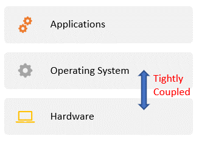

Figure 2.1: OS tightly coupled with hardware

### 2.3.1 Virtual Machines

You may have encountered the concept of a virtual machine before when you learned Java (or similar) programming language or if you needed to install an application that is not compatible with your operating system (e.g., needed to install an Oracle DBMS on a Mac machine). These are two different types of virtual machines.

A Virtual Machine is a bounded environment that serves as a decoupling layer between two sub-systems. It appears to be a full machine to one sub-system while allowing it controlled access to the other.

With the Java language, the source code is translated into and shipped as an intermediate language (byte-code). To execute the program, it has to run in the JVM (Java Virtual Machine), which translates the byte-code into the language specific to the actual machine it is running on. The JVM appears to be a machine on its own to the program. So, the JVM adds a layer between the program and the actual machine to ensure the independence of the Java program and allow for portability. This is an example of a &quot;process virtual machine&quot;.

_A **Process Virtual Machine**_ _is a VM dedicated to a specific process and is terminated after that process is done._

In the case of installing Oracle DBMS (a Windows-compatible software) on Mac, you would need to install a Windows emulator first then install the DBMS on top of it. To the DBMS, the emulator appears to be a Windows machine on its own. This is an example of a &quot;system virtual machine&quot;.

_A **System Virtual Machine**_ _is a VM that supports an operating system and all the processes it may include._

### 2.3.2 Virtualization on the cloud

In the cloud computing context, adding a virtualization layer between the hardware resources and the operating system allows the provider to create multiple system virtual machines with different operating systems on the same physical server, each with controlled access to the actual hardware resources.

### 2.3.3 Virtual Machine Monitors / Hypervisors

In order to allow the hardware resources of one machine to be shared among multiple virtual machines, a new layer is introduced in the form of software called the hypervisor or the virtual machine monitor (VMM). As shown in the image below, there are three main types of VMMs; they can be installed directly on top of the hardware layer, in which case, it is called _**bare-metal VMM**_. Alternatively, it can be installed on top of a host operating system, in which case it would be called a _**hosted VMM**_, which may affect the performance since accessing the resources would require going through two additional layers instead of one. However, it provides a level of usability and convenience higher than that of the bare-metal VMM. The _**hybrid VMM**_ offers the best of both worlds, so you can have a bare-metal VMM that doesn&#39;t mandate monopoly over the hardware resources and allows for a host operating system to be installed on the side.

Multiple virtual machines can be installed on top of the hypervisor, each with its own operating system, a guest OS, and its own application. Each of these virtual machines would be completely independent of the other VMs that share the physical resources with it. The VMs are also independent of the actual hardware configuration and specifics; they only need to know how to communicate with the hypervisor.

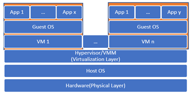

Figure 2.2: Hosted Hypervisor

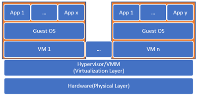

Figure 2.3: Bare-Metal Hypervisor

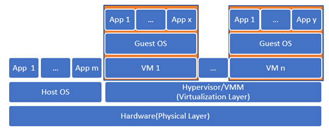

Figure 2.4: Hybrid Hypervisor

### 2.3.4 Live Migration

Just like how the JVM allows for the interoperability of Java programs, the hypervisor allows for live migration of virtual machines, which made many of the promises of the cloud services possible. Since a virtual machine can run on any physical server as long as it has the same hypervisor installed, mechanisms to ensure high availability, fault tolerance, and load balancing can be put in place.

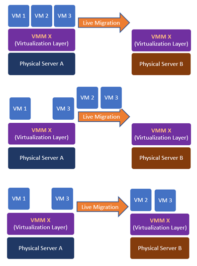

Figure 2.5: Live Migration

# 2.4 Compute Services

One of the main services offered by a cloud provider is the compute services, through which you can provision a virtual machine on the provider&#39;s infrastructure. In the following subsections, we&#39;ll practice provisioning and accessing virtual machines on GCP.

### 2.4.1 Provisioning and accessing a compute engine through the console

1. Go to [https://cloud.google.com/](https://cloud.google.com/)and log in using your GCP account you created in chapter 1.
2. Click on the &quot;Go to console&quot; button
3. Click on the hamburger button highlighted by rectangle 1 in the image below to open the navigation menu.
4. Under the &quot;Compute&quot; category, click on &quot;Compute Engine&quot;.
5. If this is the first time for you to use the service, it may take a few seconds to initialize it.

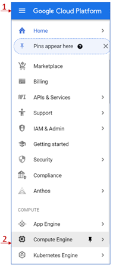

Figure 2.6: Compute Engine Service

1. If this is the first instance you create, you&#39;ll see the dialog box shown below.

Figure 2.7: VM instances dialog box

1. Click on the &quot;Create&quot; button to open the &quot;Create an instance&quot; form.
2. Set the name of your instance as well as the region and the zone in which you would like to be provisioned.
3. Specify the machine configuration in the section pointed at by arrow 1 in the image below. You can see there are four machine families that you can choose from. If you&#39;re planning to use the instance in tasks that include intensive computations, you can select the &quot;Compute-optimized&quot; family. If you&#39;re planning to use the instance for tasks that require large memory, you can choose the &quot;Memory-optimized&quot; family. If you don&#39;t have any particular optimization needs, you can select the &quot;General-purpose&quot; family.

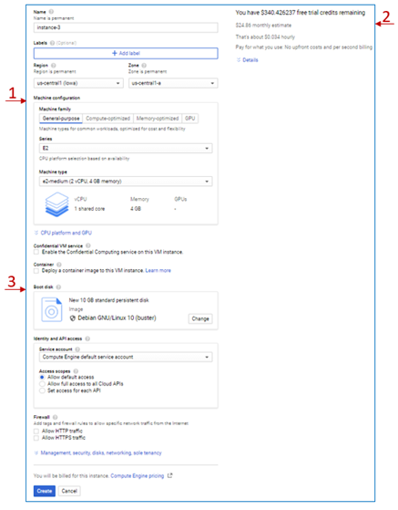

Figure 2.8: VM instance Creation

1. You can set a more specific configuration under each family, which will affect the pricing, as you can see on the right side of the page and pointed at by arrow 2.
2. Try changing the options selected and see how they affect the pricing.
3. For this exercise, we&#39;ll leave the default settings.
4. Arrow 3 in the image points at the &quot;Boot disk&quot; option. Here you can select the image you would like to install on your VM. This image could include only the operating system or include additional installations like a DBMS, for example. The choice of the image also affects the pricing.
5. Click on the change button and select a different image and notice how it affects the price.
6. Again, for this exercise, we&#39;ll keep the default option.
7. We&#39;ll discuss some of the other options later in the proper context. However, you can have a brief idea of any option by clicking on the question mark icon beside it.
8. Click on the &quot;Create&quot; button and wait for a few seconds while your instance is provisioned.
9. Once the instance is ready, you can see it listed under the VM instances with a green checkmark beside its name.

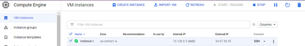

Figure 2.9: VM Instance Created

1. You can stop, start, suspend, or delete the instance by checking the box beside the name and clicking on the corresponding button in the top menu. You can also see the same options (and more) by clicking on the three dots button at the end of the row.
2. Under the &quot;Connect&quot; column, you can see how you can connect remotely to your instance, for example, using the SSH protocol.
3. Click on the SSH button to open web-based command-line access to the instance.
4. You can try out some Linux commands just like you would with an actual machine.

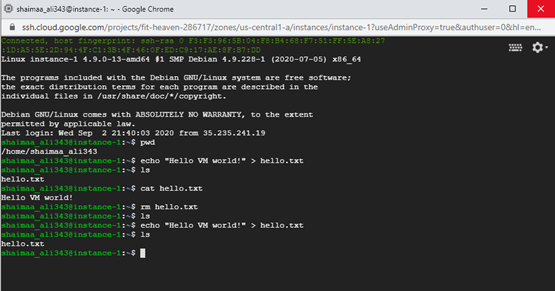

Figure 2.10: SSH access to the VM instance

1. Stop the instance you created, just to get into the habit of stopping the services after you are done working with them in order to avoid wasting the resources.

### 2.4.2 Accessing a compute engine instance through the command line from the local environment

Now we are going to practice accessing the cloud resources through the command-line tool in the local environment we&#39;ve prepared in chapter 1.

First, we&#39;ll access the VM we created in the previous section.

1. To list all compute instances available under your account, type the following command in your command-line/terminal session.
  `> gcloud compute instances list`
2. you should see the list of instances you have under your account listed as shown in the figure below.

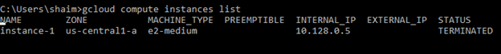

Figure 2.11: listing instances through the SDK

1. We can see that the instance we created in the previous section is displayed, and its status is &quot;Terminated&quot; as we should expect since we did stop it on the console before.
2. Now, we would like to start it in order to access it through the command-line interface; this is not as straightforward as clicking a button as we did on the console, we need to know the command that would allow us to do that, but this is not too hard either, even if you didn&#39;t know the exact command, we could use the help available through both the command-line or through GCP documentation.
3. To search for help through the command line, we can use the following command:
\&gt; gcloud help -- \&lt;search-terms\&gt;

So in our case, we would like to search for the command that starts an instance so we can use the following command to look it up:
\&gt; gcloud help -- start instance

1. The result would be a list of commands related to the search terms, the one closest to what we are looking for is shown in the image below.

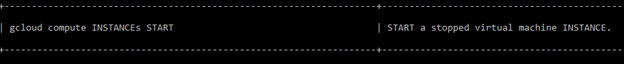

Figure 2.12: Help search result

The GCP Docs offer a more detailed explanation, so if you go to [cloud.google.com](https://cloud.google.com/), you can see in the upper-right corner a link to the documents highlighted by arrow 1 in the figure below, or you can put your term in the search box highlighted by arrow 2.

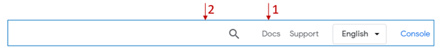

Figure 2.13: GCP Docs

In our case, I entered the search terms  &quot;gcloud start instance&quot; and the command we are looking for appeared as the first item in the results list.

Figure 2.14: GCP Docs search results

 Clicking on it will take us to the command&#39;s page with all the details about using it.

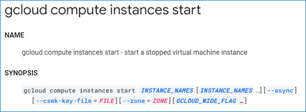

Figure 2.14.1: GCP Docs help page

So based on what we&#39;ve learned, we can issue the following command in order to start the instance:

        `> gcloud compute instances start instance-1`

We can see in the image below the output from the start command, and when we list the instances again, we can see that the status is now &quot;Running&quot;.

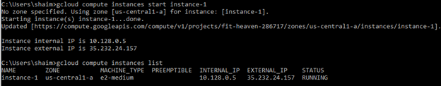

Figure 2.15: Starting an instance through the SDK

Now we need to know how to connect to the instance; you already learned how to find the command if you don&#39;t know it, so we&#39;ll skip the searching part. The following command allows us to create an ssh connection to the instance named &#39;instance-1&#39;:

        `> gcloud compute ssh instance-1`

If this is the first time you run the command, you need to specify the zone where you created the instance. Alternatively, you can set a default project, region, and zone using the command \&gt; gcloud init.

There are several steps executed behind the scenes just by issuing this command. Here&#39;s a brief of these steps:

- The credentials you obtained and stored in your local machine when you ran the gcloud login auth command will be retrieved.
- Generate a public/private key pair
- Store the new public key in the VM
- Use the private key generated to connect to the machine.

Now that we&#39;re connected to the instance, we can work with it the same way we did using the console by issuing any Linux commands we&#39;d like to get executed, as shown in the figure below.

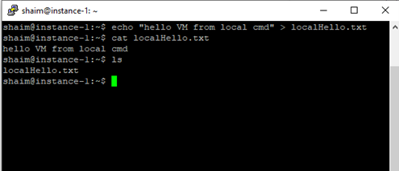

Figure 2.16: Accessing VM instance from the local environment

Notice that the file hello.txt that we created on the instance through the console didn&#39;t appear when we issued the &#39;ls&#39; command. You can also see that the user name as it appears in the prompt is different from the user name shown in the prompt. So you have to be careful if you&#39;re accessing the instance using a different environment as it may cause confusion.

However, we&#39;re still using the same virtual machine, so both files exist, only in different home folders, since it&#39;s a different user.

In the figure below, I changed the directory to go one level up using the command cd .. then issued the command ls to see the content of that directory. We can see that there are two home directories, and both files exist each in its respective directory.

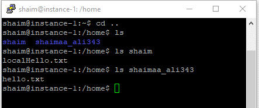

Figure 2.17: Local vs. Console access

Now let&#39;s stop the VM through the command line using the following command:

`> gcloud compute instances stop instance-1`

The figure below shows the output from the &#39;stop&#39; command as well as the instance&#39;s status showing as &quot;Terminated&quot; again after listing the instances.

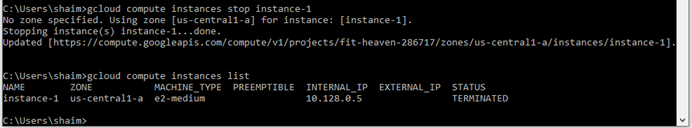

Figure 2.18: Stopping an instance through the local environment

### 2.4.3 Accessing compute engines programmatically (using Node.js)

The third way to access your cloud resources is programmatically using the google cloud client library. In chapter 1, we prepared the environment for this type of access by installing Node.js and running the authenticate command. Now, we are going to use a sample script that lists the available instances in a given project.

We&#39;ll use one of the scripts provided as a sample in GCP docs here ([Node.js client library  |  Google Cloud](https://cloud.google.com/nodejs/docs/reference/compute/latest)). If you click on the link and scroll down to the &#39;Samples&#39; section, you&#39;ll see a list of sample scripts. You can see the code by clicking on the &#39;source code&#39; link provided. We will be using the &#39;List All instances&#39; script, so open its source code and have a look at it.

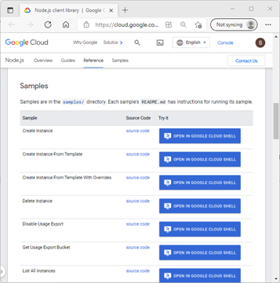
Figure 2.19: Sample JS Scripts

We are going to try to run this script from the local machine. But first, we need to make some preparation. We need to install the npm module of the google client library API that allows us to access the compute instances programmatically. We can do this using the following steps.

1. Create a directory for this example and give it a meaningful name (e.g., progAccess)
2. From the command-line change directory using the cd command to go to the directory you just created \&gt; cd progAccess
3. Run the following npm install command to install the cloud client library progAccess\&gt; npm install @google-cloud/compute
 (if you&#39;re running this command on a Linux machine, you may need to add sudo at the beginning)
4. Create a text file with the name listAllVMs.js and copy the sample script into it.
5. The script expects the project id to be sent as an argument, so in order to execute it, we need to issue the command
progAccess\&gt; node listAllVMs.js \&lt;project-id\&gt;

The figure below demonstrates how I ran the command and its output.

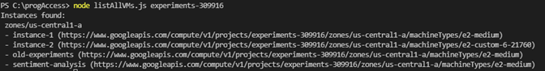
Figure 2.20: VM instances accessed and listed programmatically

Please note that Node.js is not the only way to access GCP services programmatically. You can see a list of client libraries for other languages [here](https://cloud.google.com/apis/docs/cloud-client-libraries), and you can find the documentation for the compute engine Node.js client [here](https://googleapis.dev/nodejs/compute/latest/index.html).

In this section, we created a few virtual machines, and we learned that a virtual machine allows us access to virtualized portions of the physical resources. If you go to the dashboard of the console and if you didn&#39;t change the default settings of the dashboard, you should be able to see the compute engine CPU utilization card similar to the one shown in the figure below. But the CPU is not the only virtualized resource accessible through the VM. Storage resources are essential for the VM, just like they are essential for any physical machine. Can you imagine buying a computer that doesn&#39;t have a hard desk? In the next section, we&#39;ll learn how to work with the basic storage services provided by GCP.

Figure 2.21: CPU utilization card

# 2.5 Storage Services

There are three main types of storage services, block storage, object storage, and file storage. The block storage is the most basic of them, and it&#39;s basically a virtual hard disk in which the data are stored in raw blocks without any structure or format associated with it unless through a file system that&#39;s part of the operating system.

Figure 2.22  demonstrates how the data are stored in numbered _**blocks**_.

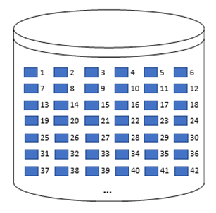

Figure 2.22: Block Storage

Figure 2.23 shows how the file system determines which of these blocks belong together to form a file/directory structure and associate metadata to them (e.g., file name, date updated, etc.). Cloud _**file storage**_ services like Filestore on GCP allow us to create a network file server that&#39;s independent of the operating system and can be shared among multiple VMs.

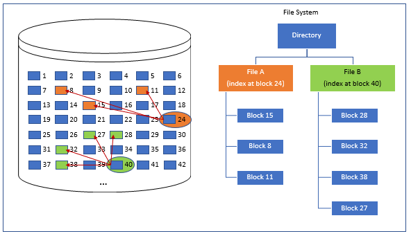

Figure 2.23: File Storage

_**Object storage**_ allows for offering the storage service without needing a server since the data and the metadata are encapsulated in objects stored in buckets. The buckets are accessible directly using web protocols such as HTTP. So, a bucket is capable of receiving an HTTP request, and it sends the requested data in an HTTP response, which makes it possible to use the bucket as a basic web server that serves with static content only.

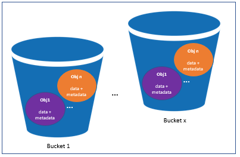

Figure 2.24: Object Storage [1]

If you go to GCP&#39;s console and open the side navigation menu, you&#39;ll see under the &#39;Storage&#39; category there are three services. The &quot;Data Transfer&quot; service is used to transfer the data to and from cloud storage. The &#39;Filestore&#39; is GCP&#39;s file storage, and &#39;Storage&#39; is GCP&#39;s object storage.

Figure 2.25: GCP&#39;s Storage services

The block storage is not listed here because it&#39;s not accessible unless through a compute instance. It&#39;s listed under the sub-menu of the &#39;Compute Engine&#39; service with the name &#39;Disks&#39; as shown in the figure below.

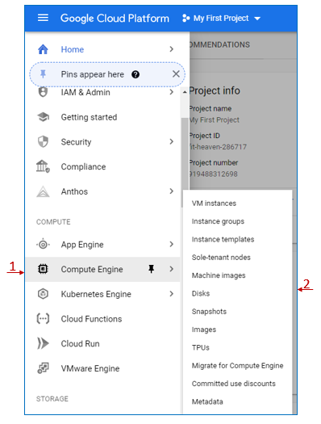

Figure 2.26: GCP Compute Engine Storage

If you click on the &#39;Disks&#39; menu item, you&#39;ll see a list of the disks you created. The image below shows the two disks that were created as part of the two instances we provisioned before. Each disk takes the same name as the VM instance it&#39;s used by, as you can see by looking at the &#39;Name&#39; and &#39;In use by&#39; columns.

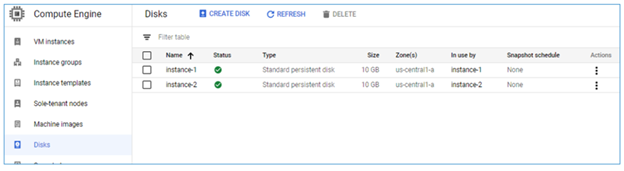

Figure 2.27: Disks created for the compute instances

We can also create a disk independent from any VM by clicking on the &#39;Create Disk&#39; button highlighted by the red rectangle. This disk can be treated like a virtual external hard drive that we can attach to any VM instance. In fact, it can be accessed by multiple instances in a read-only fashion, but it can be used for writing by only one VM.

Let&#39;s start by creating the disk by clicking on the &#39;Create Disk&#39; button, which opens the &quot;Create Disk&quot; form that allows us to make the settings for the newly created disk. For the sake of this example, we&#39;ll leave the default settings, including the name, which is &#39;disk-1&#39;. Before we click create, take a moment and look at the different settings in the form, try to understand one of them, and answer the corresponding review question.

Now click on the &#39;Create&#39; button and give it a few moments to be provisioned. &#39;disk-1&#39; should appear on the list with the size 100 GB (the default) as opposed to the 10 GB of the two other disks as shown in the figure below. Since this disk is unattached to any instance, its &#39;In use by&#39; value is empty.

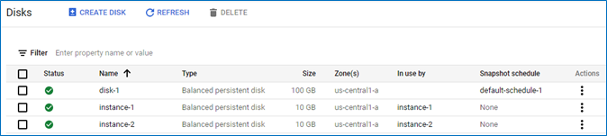

Figure 2.28: Newly created disk shown in the disks list

Let&#39;s attach disk-1 to VM instance-1 for read and write, so click on VM instances in the side menu, then click on instance-1 and scroll down in the VM instance details page to see the &#39;Boot disk&#39; section that displays the information about the disk that was created for this instance highlighted by arrow 1 in the figure below.

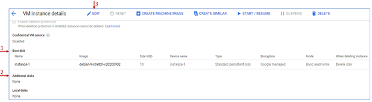

Figure 2.29: Disks sections in the VM instance details page

Arrow 2 in the figure highlights the &#39;Additional disks&#39; section, which shows that no additional disks are attached to this instance yet. Click on the &#39;Edit&#39; button highlighted by arrow 3 to be able to make changes to the instance.

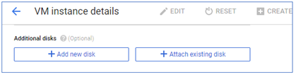

Figure 2.30: Attach existing disk

Scroll down to the &quot;Additional disks&quot; section and click on the &quot;Attach existing disk&quot; button. In the existing form shown below, choose &#39;disk-1&#39; from the drop-down menu, keep the default &#39;Read/write&#39; mode and click &#39;Done&#39;.

Figure 2.31: Additional disk settings

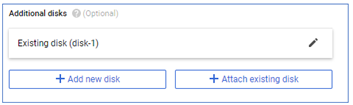

Figure2.32: New disk added to a VM instance

Scroll down and click on the &#39;Save&#39; button to save the changes made to the VM.

Now, let&#39;s go back to the instances list and connect to instance-1 via SSH. We can see all disks attached to this instance by issuing the command$ ls -l /dev/disk/by-id . You can see that disk-1 is listed with the alias google-disk-1, as shown in the image below.

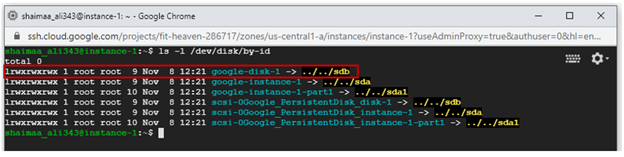

Figure 2.33: Additional disk listed within the VM instance

Two steps remain in order to be able to access this disk. It needs to be formatted to create its own file system, then mounted to the instance&#39;s file system.

The command below uses [mkfs](http://manpages.ubuntu.com/manpages/xenial/man8/mkfs.8.html) tool (short for make file system) to format a device specified by the \&lt;DVICE\_ID\&gt; with [ext4](http://manpages.ubuntu.com/manpages/xenial/man8/mkfs.ext4.8.html) file system. (Please note that this command will delete any contents on the disk, so be careful when you specify the disk id)

`$ sudo mkfs.ext4 -m 0 -E lazy_itable_init=0,lazy_journal_init=0,discard /dev/disk/by-id/<DEVICE_ID>`

The image below shows the output of formatting the disk with the id &#39;google-disk-1&#39;.

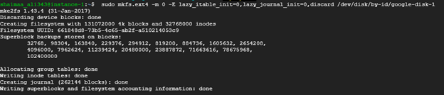

Figure 2.34: Formatting the additional disk using mkfs tool

In order to mount that disk to the instance, we need to create a directory under the path /mnt/disks then use this directory as the mounting point for the disk. The following command would create that directory and the parent directories if they didn&#39;t already exist.

`$ sudo mkdir -p /mnt/disks/<mount-dir-name>`

Since we&#39;re going to use this disk for writing, we need to change the permissions to allow writing for all users with the following command:

`$ sudo chmod a+w /mnt/disks/<mount-dir-name>`

The following command uses the [mount](http://manpages.ubuntu.com/manpages/xenial/man8/mount.8.html) tool to (not surprisingly) mount the additional disk using the directory created for it.

`$ sudo mount -o discard,defaults /dev/disk/by-id/<device-id> /mnt/disks/<mount-dir-name>`

Executing the previous two commands after replacing the \&lt;mount-dir-name\&gt; with the &#39;additional-disk-1&#39; and the device-id with &#39;google-disk-1&#39; and we are ready to use the device.

Remember the two files that we created at the beginning of the chapter? We&#39;ll copy these two files to the new disk then will display the contents of the new copies as shown in the image below:

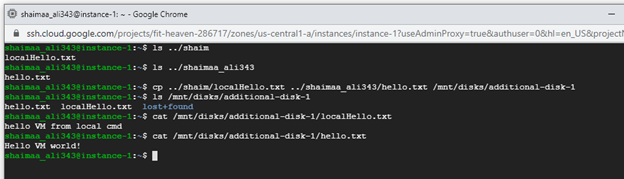

Figure 2.35: Using the additional disk for reading and writing

So, we were able to use the disk for both reading and writing, and if we go back to the disks list, we&#39;ll see that this disk is now in use by &#39;instance-1&#39;.

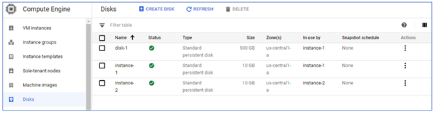

Figure 2.36: The Additional Disk &#39;In use by&#39; instance-1

# 2.6 Summary

In this chapter, we discussed the following:

- The resource virtualization technology enabled the access of shared resources provided through cloud services.
- Three different ways that we can work with GCP cloud resources, namely, the console web interface, the local command-line interface using the SDK, and programmatically using client libraries.
- Provision and access virtualized compute resources by creating VM instances.
- Provision and access virtualized storage resources by creating virtual disk drives.

# Image Credits

[1] [Image](https://commons.wikimedia.org/wiki/File:AWS_Simple_Icons_Storage_Amazon_S3.svg) courtesy of Amazon Web Services LLC in the Public Domain , modified by the author using PowerPoint.

[GCP Screenshots] &quot;Google and the Google logo are registered trademarks of Google LLC, used with permission.&quot;

Unless otherwise stated, all images in this chapter were created by the author Shaimaa Ali using either MS PowerPoint or MS Visio or both.

© Shaimaa Ali 2022