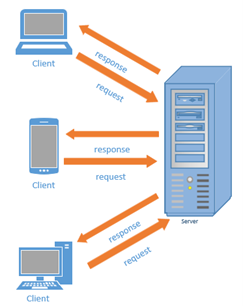
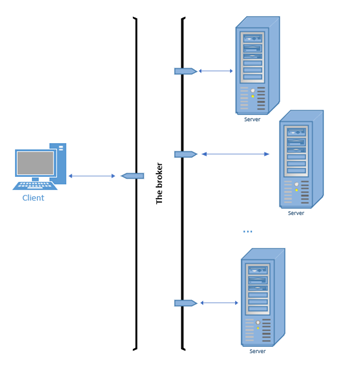
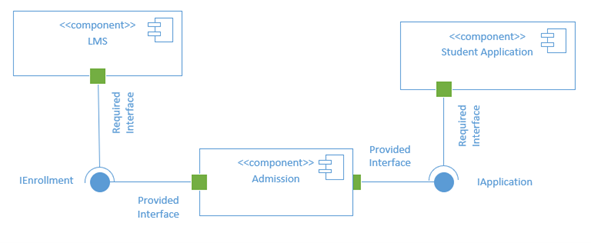
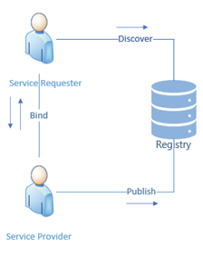
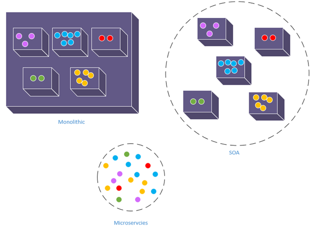
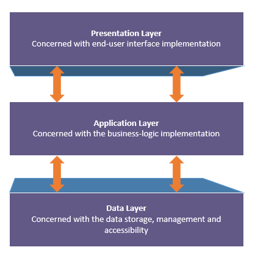
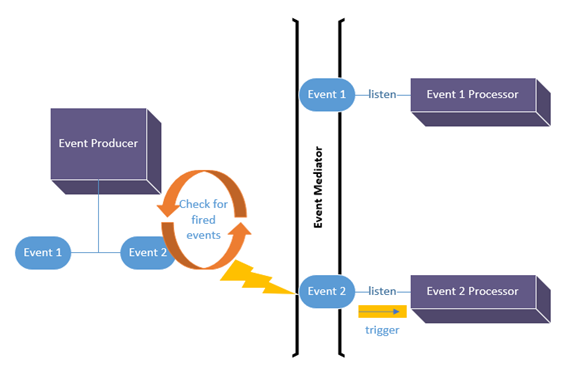
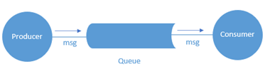
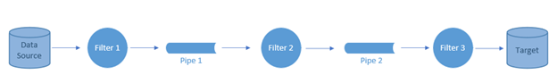

# **Chapter 3: Architecture Design for Cloud Applications**

# 3.1 Learning Outcomes
By the end of this chapter, the reader should be able to:
- Recognize common architectural patterns.
- Recognize the design and planning considerations specific to cloud applications.
- Combine different architectural patterns to create a cloud application design.

# 3.2 Introduction

Architecture, in general, is the careful consideration of organizing interrelated components in order to form a more complex structure.

In software engineering, the architecture design indicates creating a plan of how the various elements of the software system need to be arranged to meet the system&#39;s requirements. Architectural design patterns were created to solve common architectural design problems.

Real-life cloud-based applications usually require aggregation(s) of well-coordinated services implementing a combination of design patterns. These services don&#39;t have to be from the same provider. In fact, a multi-cloud approach is trending in the industry. For example, Coca-Cola has adapted a multi-cloud approach in which they leverage the services of GCP, AWS, and MS Azure. (see: [Coca-Cola announces partnership with Microsoft](https://news.microsoft.com/2020/04/27/the-coca-cola-company-announces-strategic-partnership-with-microsoft-to-transform-global-engagement-and-experiences/) and [Swire Coca-Cola AWS Case Study](https://aws.amazon.com/solutions/case-studies/swire-coca-cola/) )

In addition to the various services, cloud providers also offer several deployment options to consider while creating the architecture. Section 3.3 discusses the different deployment options, and in section 3.4, we list ten of the common architectural patterns suitable for the cloud.

While creating such a multifaceted architecture, you may face a trade-off between conflicting requirements and the need to decide which requirement has higher priority. For example, the serverless deployment option typically offers the best opportunity for cost-saving; however, it limits the running time of each component to a few minutes. Would it be worthwhile to spend the time breaking down your components into microservices and plan the coordination among them? That&#39;s a question you need to answer before you make the decision.

# 3.3 Cloud Applications Deployment Options

According to Merriam-Webster Dictionary:

> **Deployment** is theplacement or arrangement (as of military personnel or equipment) in position for a particular use or purpose

In the context of software applications, deployment has two main stages; the preparation of the environment needed for the application to run in the final destination (e.g., Installing JVM for java application, DBMS installation, ... etc.) and transferring the application itself (e.g., the executables, the database schema, and data population, ... etc. ) into this environment for the end-user to be able to run it.

Creating a deployment strategy is essential for the success of any software application, especially so with cloud-based applications. In chapter 1, we talked about the three standard service models  IaaS, PaaS, and SaaS. If we take the role of the software developer (or the development house if you like) that&#39;s planning to create a software as a service; we have a number of deployment options that we can choose from.

## 3.3.1 IaaS Deployments

IaaS deployments involve provisioning the needed infrastructure, and then you have both the freedom and the responsibility to install and manage any platform needed for your application.

## 3.3.2 PaaS Deployments

PaaS deployment delegates the responsibility of installing and managing a certain platform to the cloud provider while you would be only responsible for the deployment and the management of your data and applications, including external libraries and dependencies.

In chapter 4, we&#39;ll go through an example of creating applications using IaaS and PaaS deployments.

## 3.3.3 Container-Based Deployments

Container-Based deployment allows for encapsulating the run-time environment, including complicated dependencies into one package to facilitate the deployment process instead of deploying pieces of executables and libraries, which is proven to be error-prone. Cloud services are available to create and deploy such containers.

In chapters 5 and 6, we&#39;ll discuss how to create and deploy container-based applications in more detail.

## 3.3.4 Serverless-Based Deployments

Some applications don&#39;t need to be up and running, consuming the resources all the time. They only need to be executed for a few minutes based on specific events. Cloud providers allow for such applications to be dormant until they get triggered. So the application and its dependencies would be containerized and stored in a location known by the &#39;Serverless&#39; service. When the event or the occasion takes place, the following steps will happen autonomously through the serverless framework:

- Start the service/server needed to run the application
- Execute/run the application.
- Terminate the service/server.

So the term serverless may be a little misleading. It doesn&#39;t mean that there&#39;s no server. It just means that you, the creator of the application, are not responsible for starting or terminating it. It would autonomously start when the event occurs then terminate after the execution is over, saving you the cost of occupying the resources when they are not needed.

In chapter 7, we&#39;ll discuss in more detail the concept of serverless service and creating serverless-based applications.

# 3.4 Architectural Patterns

Here is a list of popular architectural design patterns.

## 3.4.1 Stand-Alone (Single Machine) Vs. Distributed Architectures

The stand-alone architecture might be the most straightforward architecture that is used when the software is intended to run by itself. For example, a document editor is an example of stand-alone software. On the other hand,  A distributed architecture is in effect when the software is divided into several pieces distributed over several machines. Obviously, a cloud-based application requires a distributed architecture. We only mentioned the stand-alone concept here for the sake of contrast.

## 3.4.2 Client-Server Architecture

In the client-server architecture, the software is divided into two pieces. One piece takes most of the responsibilities, called the server, and the other takes fewer responsibilities, which is the client. Depending on how many functionalities are implemented on the client-side, it can be a _thin_ client with very few functionalities or a _thick_ client with more functionalities.

The server, basically, provides a service and is able to receive and understand requests from client software, then creates a response for that request and sends it back to the client. The machine (either physical or virtual) that hosts either software is often given the same title. So the machine on which the server software is running is also referred to as the server, and the machine that hosts the client is also often referred to as the client. On diagrams like the one below, the server, whether the software or the host machine, is usually indicated by a computer case. The client is often indicated by a computer with a monitor, a laptop, or more recently, a mobile device.

Figure 3.1: Client-Server Architectural Pattern

An example of a general client-server software is Mersive Solstice, an in-room collaboration platform. In order to use it you, need to install a server on the machine connected to a projector,for example, then anyone who wants to display their screen would need to install a client, connect through it to the server, and everyone can see their screen.

The main advantage of this architectural pattern is that it allows access to one installation from various clients, which makes maintaining the software much easier. More specific and commonly used servers are typically named after the service they offer. For example, a &quot;Database Server&quot; is the server that allows access to a database through a database management system (e.g., Oracle DBMS), a &quot;Web Server&quot; is a server that provides access to a web application using internet protocols like HTTP (e.g., Apache webserver)  and an &quot;Application Server&quot; is a server that allows access to applications through a network, not necessarily the internet, (e.g., JBoss application server).

The Client-Server architecture has always been of prime importance in software applications. The only difference with the cloud is that instead of having physical machines to host the server (or the client if needed), you would have a virtual machine. In addition to that, you may have some of the commonly used servers (e.g., MySql DB server) installed and maintained by the cloud provider and offered to you as a PaaS.

## 3.4.3 Broker Architecture

In the broker architectural pattern, an intermediary piece of the software is introduced to act as a bridge between the client and the server or multiple servers. So instead of sending the request for the service to the server directly, the client would send the request to the broker. The broker will then find the proper server and direct the request to it, or the client may attempt to send the request directly to the server, but the broker would intervene and redirect it.

The broker&#39;s role may involve only the mere redirection of the request. For example, a load balancer may receive the requests for a web application and direct it to one of the replica hosts. Alternatively, the broker&#39;s role may involve applying a sort of processing on the request before directing it to the server, for example, a &quot;message broker&quot; that acts as a translator between a sender that can communicate using one messaging protocol and a receiver that can communicate with another messaging protocol. The image below shows a general illustration of the broker pattern.

Load balancing is an important service on the cloud, which can be implemented using the Broker architecture.

Figure 3.2 The Broker Architectural Pattern

## 3.4.4 Component-Based Architecture

The component-based approach aims to split the software into loosely-coupled shareable components to enhance the reusability and maintainability of the components, which would also enhance the productivity of the development process. The component, which is the building block of the architecture, should encapsulate related functionalities to maximize the cohesion within the component and minimize the coupling among different components. For the components to work together as a system, some of them need to provide interfaces for any functionality that others can use. Others that wish to use those functionalities would need to contain interfaces that adhere to the requirements specified by the provided interfaces.

The figure below demonstrates an example of a component-based system using the Unified Modeling Language (UML) notations. Here, the &quot;Admission component&quot; can be shared/re-used by the &quot;Student Application&quot; and the Learning Management System (LMS) components, however, in different ways. In order to allow the functionality related to retrieving enrollment information, the &quot;Admission&quot; component provides the interface &quot;IEnrollment&quot; with specifications that define how this interface can be used. Any other component that would like to utilize this functionality, the LMS in this example, needs to meet the specifications of that interface and use it to retrieve the enrollment information. On the other hand, the &quot;Admission&quot; component provides the &quot;IApplication&quot; interface to specify the requirements of accessing its application processing functionalities, and the &quot;Student Application&quot; component would need to meet these requirements in order to access the functionality.

Figure 3.3: Component-Based Architecture Example

In general, a component-based architecture would be of great benefit since it allows for assigning different resources to the different components. For example, suppose you know that there&#39;s significantly more demand for a certain part of your system. In that case, you can isolate it in a separate component and assign more resources for that component only to avoid wasting the resources on parts of the system that don&#39;t need them.

## 3.4.5 Service-Oriented Architecture (SOA)

The service-Oriented architecture is a variation of the component-based architecture in which the components are offered to other components as services accessible over the network according to a pre-defined communication protocol. The general component-based architecture can be implemented by creating packages or modules within the application to represent the components. However, the SOA adds additional requirements to make sure the components represented by services are independent and self-contained yet can communicate with other services to form a bigger service or a whole system.

In general, an SOA has three main components, the service provider, which is the component that provides the service, the service requester, which is the component that wishes to make use of the provided service and the service registry, which is the database that holds the descriptions of available services. The provider publishes the service on the registry along with a description of how it can be used. The requester searches the registry to discover the existing services, then uses the description in the registry to bind itself to the provider and communicate with it (see figure 3.4).

&quot;Web Services&quot; technology is a very popular implementation of SOA where the services are accessible over the internet (using protocols like HTTP). Obviously, given AWS, the service-oriented architecture is not only suitable to create cloud applications. It was the foundation of the whole concept.

Figure 3.4: Components of the SOA architecture

## 3.4.6 Microservices Architecture

This architecture can also be seen as a variation of the component-based architecture, very similar to the SOA. However, the components are much smaller than a full service but rather a microservice. The idea is to break down the system into the smallest possible components called microservices so that each microservice can be developed, tested, and deployed on its own while still capable of collaborating with other microservices to meet the requirements of the system.

Figure 3.5 demonstrates the difference between creating a system as a _**monolithic**_ unit as opposed to the SOA and the _**microservices**_ architecture. The monolithic approach is quite problematic even if it was internally modularized as it would slow down the development and deployment processes and make the maintenance of the system very difficult. Just for a simple example, imagine that a bug was discovered in one of the features of the system. In order for this bug to be fixed, the entire system would have to be re-deployed. The SOA offered much better modularity and maintainability, but a whole service can still be too big to maintain. With the increase of popularity of the continuous delivery model, the microservices architecture also became very popular as it provides a way to break down the system into units even smaller than complete services that are much easier and faster to develop, maintain and deploy.

One of the ways that microservices architecture is implemented in a cloud context is using the serverless functions that have been trending recently, thanks to containerization technologies and the autonomous nature of cloud services.

Figure 3.5: Microservices vs. Monolithic vs. SOA

## 3.4.7 Layered (Multi-Tiered) Architecture

The Layered/Multi-Tiered architecture implements the separation-of-concerns principles by splitting the code into layers or tiers. Each tier is only concerned with its own functionalities and the interface with the layers adjacent to it. While a  system may contain any number of layers, the most common multi-layered architecture includes three layers; the data-layer, the application/business-logic layer, and the presentation layer. The data layer is concerned only with how the data is stored, managed, and accessed. The application or business-logic layer is concerned with business logic implementation. And the presentation layer is only concerned with the end-user interface (see figure 3.6).

The main premise behind this separation is that each layer may change at its own pace without affecting the other layers. For example,  the user interface may change more often than the business logic, or you may need to provide multiple user interfaces for the same system without duplicating the business logic. Also, changes in the data layer (e.g., changing the DBMS) would have minimal effect on the application or the presentation layers.

Just like the client-server architecture, the multi-layered architecture has always been important in creating software applications, and it remains so with cloud-based applications.

Figure 3.6: Multi-Layered Architecture

## 3.4.8 Event-Driven Architecture

The event-driven architecture is based on creating a mechanism to associate specific code with an occasion or event. When the event occurs, the associated code would be automatically triggered for execution.  Perhaps the most obvious implementation of this architecture is what we see in graphical user interfaces that respond to events initiated by the end-users, like mouse clicks or keyboard strokes. In addition to that, applications that handle less obvious events like data insertion or removal can also implement the event-driven architecture.

In order for a system to implement the architecture, it needs to provide a mechanism to identify when the event happens, a mechanism to link a specific piece of code to a particular event, and a mechanism to execute the linked code upon the occurrence of the event.

There are three main components in the event-driven architecture, the producer, the processor, and the mediator. The event _**producer**_ is the part of the system that fires (produces) the event. The event _**processor**_ is the part of the code that gets triggered for execution upon the firing of the event. The _**mediator**_ is the part of the code responsible for linking the producers and the consumers.

Figure 3.7 illustrates an example of event-driven architecture. In the figure, the producer can produce two types of events, and it implements a mechanism that constantly checks whether any of these events is fired (i.e., occurred).  There are two event processors; each of them expresses interest in being notified and triggered for execution when the corresponding event fires. The mediator&#39;s responsibility is to receive the notification of the firing of an event from the producer and passes it along to any interested processor. For example, when the checking mechanism identifies that event 2 was fired, often indicated by a lightning bolt, it will notify the mediator, which in turn would trigger the processor for execution.

Figure 3.7: Event-Driven Architecture

Example usage of event-driven architecture in a cloud application would be to combine it with the microservices architecture to create a serverless function that gets executed upon a specific event (e.g., a new data entry).

## 3.4.9 Asynchronous Messaging Architecture

This architecture is more of a communication pattern that allows decoupled components or independent services/microservices to interact in order to meet the system&#39;s requirements. In general, there are three components in the asynchronous messaging architecture the message producer, the message consumer, and the message queue. The producer generates the message and adds it to the queue for the consumer to read at a later time. There are several variations of this architecture; for example, the publish-subscribe architecture allows the producer to generate/publish different types of messages, and the consumers are to select/subscribe for the type of messages they would like to consume. Figure 3.8 illustrates the general asynchronous messaging architecture.

The asynchronous messaging architecture is commonly used to provide a means of communication between decoupled modules/components.

Figure 3.8: Asynchronous Messaging Architecture

## 3.4.10 Pipe-Filter Architecture

The pipe-filter architecture can be seen as a combination of asynchronous messaging and microservices architectures. In this architecture, a complex process would be broken down into smaller sequential processes/microservices that are called filters. The output from each filter is placed in a pipe to be processed by the following filter until the target of the overall processing is achieved (see figure 3.9).

Figure 3.9: Pipe-Filter Architecture

The pipe-filter architecture is commonly used in data since applications with each filter representing a data analysis functionality that applies on the data stream before being placed in the pipe for the analysis functionality in the next filter to consume.

## 3.5 Architecture Design for Cloud Applications

In summary, creating an architecture for a cloud-based application would involve answering the following questions:

- What are the components of the system to be created?
- What is/are the service(s) to be used for each component, and from which provider?
- How would these components communicate with each other, if needed?
- What is the architectural pattern or group of patterns most suitable for the system&#39;s needs?
- What is the deployment option for each component?

In the following chapters, we are going to explore some applications to highlight examples of important design decisions while creating cloud-based applications.

# Image Credits

Unless otherwise stated, all images in this chapter were created by the author Shaimaa Ali using either MS PowerPoint or MS Visio or both.

© Shaimaa Ali 2022