# **Chapter4: IaaS &amp; PaaS Deployment**

# 4.1 Learning Outcomes
 By the end of this chapter, the reader should be able to:
- Identify the architectural patterns of an existing application.
- Identify a suitable deployment option for each component of an application.
- Execute the deployment plan.
- Identify a suitable cloud service for each component of an application.
- Explain the rationale of their deployment choices.
- Create a cloud deployment plan.

# 4.2 Introduction

[WordPress](https://wordpress.com/) is a very popular open-source website builder that is also commonly used as an example to demonstrate cloud application deployments. We are going to follow the trend and use it as an example as well, with special emphasis on the architecture design approach that we described in chapter 3. The application is a very good example because its implementation includes several architectural patterns, and there are different ways to deploy it on the cloud, which allows us to compare the different options.

# 4.3 WordPress Deployment Plan

Since the application is already implemented, we don&#39;t need to decide on the architectural patterns. Still, it&#39;s important to understand the implementation architecture in order to make suitable decisions regarding its deployment on the cloud.

WordPress implements the multi-layered pattern in which the presentation layer is implemented using a web interface, the application layer is implemented using server-side PHP code, and the data-layer is implemented using a relational database (either MySql or MariaDB). In addition to that, there are two client-server pattern implementations within the application.

A client-server web pattern is implemented between the presentation-layer and the application-layer where the presentation-layer is accessible through the web-client (i.e., the browser), and the application-layer is contained in and accessible through a web server (e.g., Apache webserver). On the other hand, a client-server database pattern is implemented between the data-layer that includes a database server (e.g., MySql Server) and the application-layer which needs to access the database as a client. Figure 4.1 below summarizes the architectural patterns as well as the deployment plan that we are going to follow.

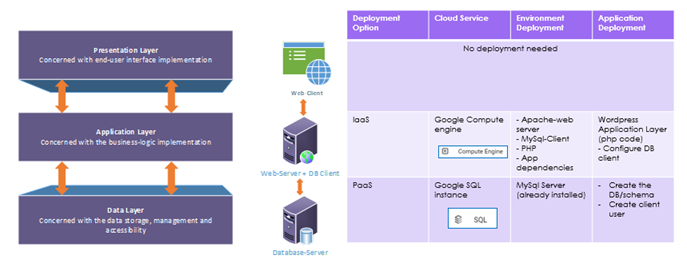

Figure 4.1: WordPress architectural patterns and deployment plan

As shown in the figure, the presentation layer doesn&#39;t need any deployment effort from our side since it&#39;s a web application, so the presentation layer would be generated automatically by the PHP code, and the web browser is (most likely) already installed on the client machine since it&#39;s already a standard.

For the application layer, we will go with the most basic deployment option (IaaS). So, we are going to provision a compute engine, and we&#39;ll be responsible for the installation and the management of both the environment and the application that we&#39;re going to deploy (including updating, maintaining, and securing).

As for the environment deployment, we need to install an Apache webserver to host the PHP application as well as the PHP interpreter. In addition to that, we&#39;ll need to install the MySql client to access the database server.

For the data layer, we can do the same thing and use the IaaS deployment option by provisioning a VM instance and installing the MySql server on it. However, since the provider already offers what we need as a PaaS, we&#39;ll go with this option instead since it would make our life easier if we delegate the responsibility of the environment to the provider, which would allow us to save our resources to focus on the application.

So, for the environment deployment, all that we need to do is to provision a cloud SQL instance that already has the MySql server environment installed in it. For the application deployment, we need to create a database(schema) within the server that will hold the tables needed for the application. In addition to that, we need to create a user with proper permissions to be used by the application layer to access the server.

In the coming sections, we&#39;ll execute the deployment plan step by step.

# 4.4 Data Layer Deployment (with Database Server)

As mentioned in the deployment plan, the decision was to go with the PaaS deployment option and use the cloud SQL service.

## 4.4.1 Data-Layer - Environment Deployment

The environment deployment here would involve provisioning the Cloud SQL instance.

1. In the side navigation menu, click on SQL.

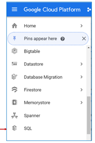

Figure 4.2: Cloud SQL service in the navigation menu

1. The dialog shown in figure 4.3 below gives us the option to either create a new SQL instance (i.e., a VM instance with a DBMS installation) or migrate an existing database. We need to create a new instance for our application, so click on &#39;Create Instance&#39;.

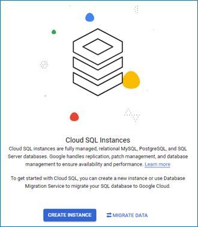

Figure 4.3: Create or Migrate Cloud SQL instances dialog

1. The next step gives us the option to choose which databases engine we&#39;d like to have installed, click on &#39;choose MySQL&#39;.

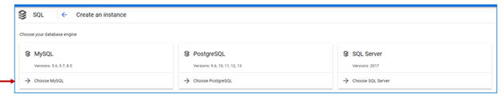

Figure 4.4: Choose MySQL engine

1. In the &#39;Instance info&#39; form, set the instance ID to &#39;wordpress-dbserver&#39; and choose a password for the root user.
2. Have a look at the possible configurations, but leave the default values.
3. Click &#39;CREATE INSTANCE&#39;, the instance details page will open, and as usual, it will take a few moments for the instance to be provisioned.

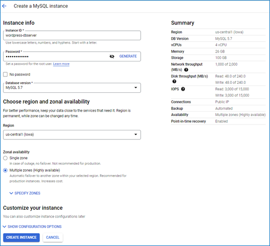

Figure 4.5: SQL instance info

1. Once the instance is provisioned, you can see it listed under the Cloud SQL instances console page and through the SDK&#39;s command-line interface.
2. An important thing to notice in the &#39;Overview&#39; page of the instance is the **&#39;Connect to this instance**&#39; card that shows the public IP and the connection name; we&#39;ll need this information when we get to connect to this instance from the client.

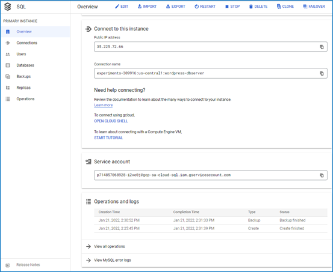

Figure 4.6: Instance public IP and connection name

## 4.4.2 Data-Layer - Application Deployment

Since the environment deployment is already taken care of, thanks to the PaaS deployment option, we only need to worry about the application deployment. Here, we&#39;ll need to create a database schema for the application and a user to be used in the application layer.

1. In the instance details page, click on &#39;Databases&#39; in the side menu. You&#39;ll see all the database schemas available on the instance.
2. Click on &#39;CREATE DATABASE&#39; to create a new schema for our application.

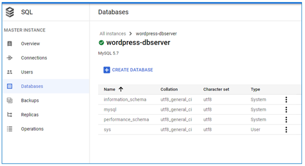

Figure 4.7: Create a new database schema

1. In the &#39;Create a database&#39; form se the database name as &#39;wordpress&#39; then click &#39;CREATE&#39;.

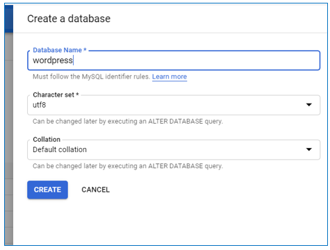

Figure 4.8: Set the new DB name

1. The new database now appears in the list.

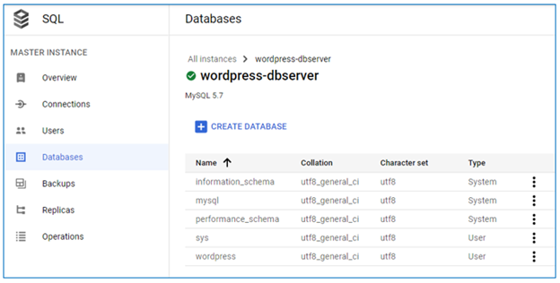

Figure 4.9: The new &#39;wordpress&#39; DB now appears under the &#39;Databases&#39; list

1. Now, to create the user, click on &#39;Users&#39;  in the side menu, you&#39;ll see that only the &#39;root&#39; user is available, click on &#39;ADD USER ACCOUNT&#39; to create a new user.

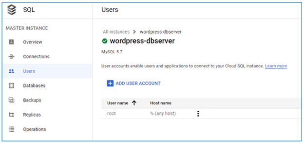

Figure 4.10: DB users list

1. In the user account form, set the user name to &#39;wordpress&#39; and choose a password. The hostname setting determines which client host this user can access the database instance from; for now, we&#39;ll leave it as &#39;Allow any host&#39;, and we&#39;ll change it later after we create the webserver instance. Finally, because this user is created through the Cloud SQL interface, it has all the privileges it needs. So, all that we have left is to click &#39;ADD&#39;.

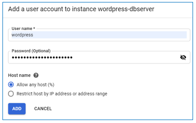

Figure 4.11: New DB user settings

1. Now we can see that the &#39;wordpress&#39; user is displayed under the &#39;Users&#39; list.

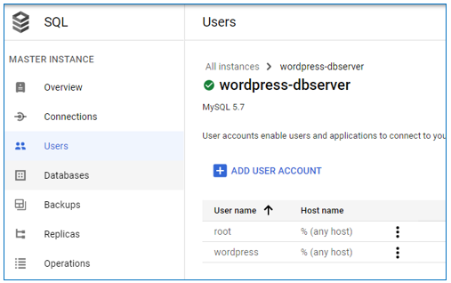

Figure 4.12: wordpress user listed under the instance &#39;Users&#39;

Finally, we need to allow access to this instance from outside. For now, we&#39;ll open the instance to be accessible from anywhere, but we can change this later for better security after we are done with the installations.

1. Click on &#39;Connections&#39; in the side menu, then click on &#39;Add network&#39; as shown in figure 4.13 below.

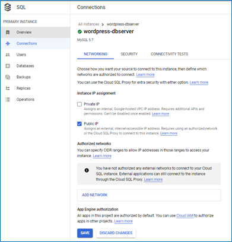

Figure 4.13: Cloud SQL Connections page

1. The &#39;New network&#39; dialog appears, as shown in figure 4.14 below. In the Network box, enter the value &#39;0.0.0.0/0&#39;, which would allow access to the instance from any IP, notice the warning message at the top; even though user credentials are still required to access the instance, it&#39;s not the most secure option, and we are going to change it later in this chapter. Click on &#39;Done&#39; then click on &#39;Save&#39;.

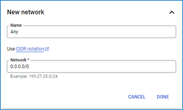

Figure 4.14: Allowing any IP to access the DB instance

Now, we are ready for the deployment of the application layer. It would be a good idea to stop this instance to avoid being charged until we need it after we have the client instance ready.

# 4.5 Application Layer Deployment (with Web-Server + DB-Client)

## 4.5.1 Application-Layer: VM instance provisioning

Remember when we mentioned that the term server is used to refer to both the server software as well as the machine that hosts it. We&#39;ll first prepare/provision the machine (the virtual machine in this case), then we&#39;ll install the webserver software on it.

1. Create VM instance with the name &#39;wordpress-webserver&#39;
2. The default settings are sufficient for this example except for the firewall settings, which by default blocks any incoming traffic to the instance. Since this instance will be used as a webserver, we need to allow HTTP traffic.
3. Scroll down until you see the firewall section and check the box to allow HTTP, as shown in figure 4.15. (we&#39;ll avoid allowing HTTPS for now to avoid distraction from the purpose of the exercise later)

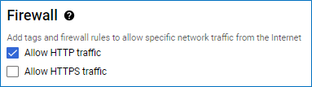

Figure 4.15: Allow HTTP traffic on the webserver instance

1. Click on the &#39;Create&#39; button, then give the instance a few seconds to be provisioned.

## 4.5.2 Application-Layer: Environment Deployment

### Installing Apache Webserver

- Open an SSH connection to the webserver instance (either through the console or through the SDK)
- To install the packages needed for the environment, we&#39;ll use the apt command, which runs a Linux-based application[package management tool](https://wiki.debian.org/PackageManagementTools).
- To make sure that apt is up-to-date, we issue the following update command:
$ sudo apt update
- To install the Apache webserver, we issue the following command and answer &#39;Y&#39; for the questions asked during installation.
$ sudo apt install apache2
- Apache webserver comes with a default website that we can use to test whether the installation was successful; this site can be accessed by sending an HTTP request to the external IP address of the machine hosting the server.
- If you go to the instances list, you&#39;ll see the external IP address listed there, as shown in figure 4.16 below. Figure 4.16: VM instance IP address
1. Copy that address, open a web browser and type &#39;http://\&lt;VM-External-IP\&gt; &#39;
2. Note that this address is not permanent. If you stop the instance and start it again, it&#39;ll be assigned another external IP address.
3. If the response to this request is the default welcome page like the one shown in figure 4.17 below, then we can trust that the webserver was installed successfully.
 Figure 4.17: Default welcome page of the Apache webserverYou can see this page stored under the directory /var/www/html/, with the name index.html. You can verify that by issuing the following commands:
$ ls /var/www/html/ (lists the content of the directory so that you can see the file there)
$ cat /var/www/html/index.html (displays the content of the file)/var/www/html/ is where we store the content of any website in order to make it accessible through the webserver that we just installed.

### Installing MySQL Client

1. Now, moving on, we can install MySql client using the command below:
$ sudo apt install default-mysql-client
2. To test the installation
   1. Start the Cloud SQL instance that contains the wordpress database
   2. Run the following command to connect to SQL instance through the client we just installed 

      `$ mysql -h <ip-of-the-sql-instance> -u <db-user-name> --password=<db-user-password>`
      -  mysqlis the command to run the client we installed
      - -h option is to specify the host of the DB server, so it&#39;s followed by the public IP of the SQL instance that you can find on the overview page.
      - -u option is to specify the user name
      - --password is to specify the password for that user
   3. If all the information entered was correct, a connection to the DB server will be established, and the MySQL prompt will appear on the terminal to allow us to issue SQL commands.
3. The prompt initially shows the database as &#39;none&#39;, so let&#39;s issue the command
`use wordpress;` to access the database we created for the application. The prompt should be updated to show the database name.
 ```
   MySQL [(none)]> use wordpress;
   MySQL [(wordpress)]>
 ```
4. The command `exit` ends the connection and stops the client.MySQL 

   `[(wordpress)]> exit;`

 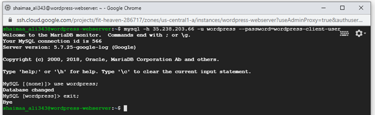
 Figure 4.18: Testing the database client
 
 As shown in figure 4.18 above, the client was installed successfully, the user credentials work, and the application database is accessible. So, the database client is ready; the final step in the environment deployment is to install PHP and its dependencies.


### Installing PHP

1. Let&#39;s start by installing wget,[a free tool commonly used to retrieve files using web protocols](https://www.gnu.org/software/wget/) (hence the name web-get) because we&#39;ll need it later.
`$ sudo apt install wget`

2. According to wordpress documentation [here](https://en-ca.wordpress.org/download/) the latest version needs PHP7.4 or higher. Normally the command sudo apt -y install php7.4 would be sufficient to install it if the package existed in the local system. However, version 7.3 is the highest version available by default, so we needed to find a way to download the package before installing it. After a google search, I found this link with helpful instructions [https://computingforgeeks.com/how-to-install-latest-php-on-debian/](https://computingforgeeks.com/how-to-install-latest-php-on-debian/) so you can go there and follow the instructions up to step 3.

3. To test the installation, we can issue the following command which, executes the command line interface of PHP and prints the version.
   
   `$php -v`

   If the installation was successful, the output should look similar to the image shown in figure 4.19 below.

 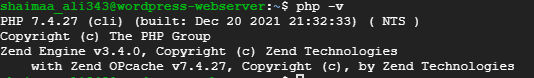
 Figure 4.19: Testing PHP installation

4. Finally, the following PHP packages are the specific dependencies needed for WordPress, so we will install them using the apt command.
 ```
   $ sudo apt install php7.4-mysql
   $ sudo apt install libapache2-mod-php7.4
   $ sudo apt install php7.4-gdNow the environment is ready, and we are good to move to the application deployment.
 ```
## 4.5.3 Application-Layer - Application Deployment

### Downloading WordPress
Using wgetwe can retrieve the latest version of WordPress then extract it from the archive by issuing the following commands:
 ```
   $ wget https://wordpress.org/latest.tar.gz
   $ tar xzvf latest.tar.gz
 ```
 If the download and extraction were successful, you should see a directory named &#39;wordpress&#39; in your home directory.

### Configuring the database access
The code inside wordpress knows how to access the database by reading the configuration set in a file called &#39;web-config.php&#39;, the directory that we just downloaded contains a sample for this configuration file named &#39;web-config-sample.php&#39; as you can see in figure 4.20 below.

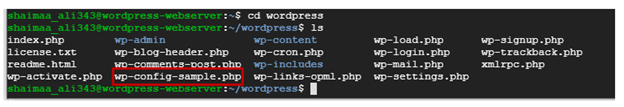

Figure 4.20: Sample Configuration file

We need to copy this file to a file with the name to web-config.php and edit it to reflect the settings of the database that we created. It&#39;s better not to rename the sample file so that we can have it as a back-up. the following two commands would copy the file and open it in the [&#39;vi&#39; editor](https://en.wikipedia.org/wiki/Vi)
 
 ```
  $ cp wp-config-sample.php wp-config.php
  $ vi wp-config.php
 ```

 Inside the vi editor, hit the letter &#39;i&#39; on the keyboard to be able to make changes; this will start the &#39;insert&#39;  mode, which will be indicated at the bottom of the screen as highlighted by the red rectangle in figure 4.21 below: 
 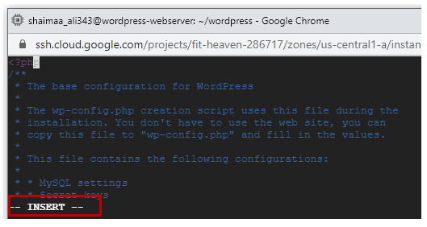
 
 Figure 4.21:The &#39;Insert&#39; mode of the &#39;vi&#39; editor
 
 Using the arrow keys in the keyboard, navigate to the lines highlighted in figure 4.22 below and change the value for the database, name, username, password, and host IP to the values we had when we created the cloud SQL instance. 
 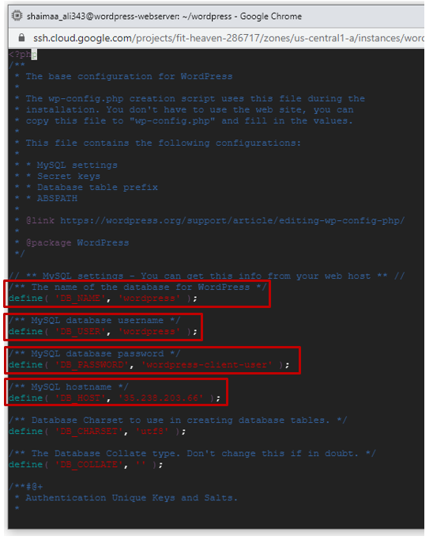
 
 Figure 4.22: DB configurations for wordpress
 
 When you&#39;re done editing, press &#39;Esc&#39; exit from the insert mode, then type &#39;:wq&#39; to write (i.e., save) and quit the editor. (tip: you can quit the editor without saving by typing &#39;:q!&#39; in case you needed to avoid overwriting)

### Deploying WordPress to the webserver
Notice that we still didn&#39;t perform the deployment yet. We were just preparing the application to be deployed. To actually deploy it to the webserver, we need to copy the entire wordpress directory to  /var/www/html/ where the webserver can access it.
1. Let&#39;s start by deleting the default welcome page that we used to test the web server as a clean-up step before deploying our application.
$ sudo rm /var/www/html/index.html
2. Then copy the content of the wordpress directory to /var/ww/html
$ sudo cp -r . /var/www/html
3. One last step before we test the installation is to let&#39;s restart the instance using the command

     `$ sudo reboot`

4. Now, if you open the browser and send an HTTP request by typing http://<vm-external-ip> in the address bar, the request will be redirected to the installation page shown in figure 4.23 below until the installation is done.

 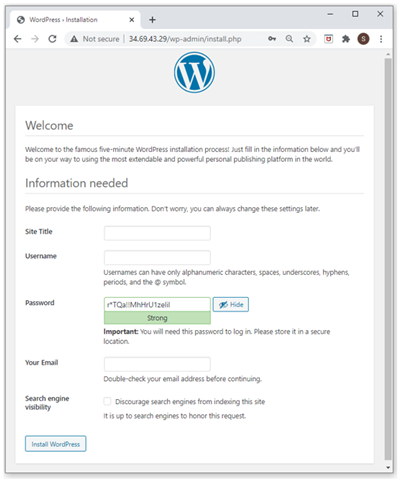
 
 Figure 4.23: WordPress Installation page

5. Fill in the required information in the installation form, click &#39;Install WordPress&#39;, and follow the instructions in the wizard to create and publish your website. After you publish the site, issuing a request to `http://<vm-external-ip>` will open index.php, which is the home page of your site.

# 4.6 Securing the database access
As mentioned before, the current security settings are not secure enough. We need to enhance the application&#39;s security by allowing access to the database only through the webserver instance. First, let&#39;s give the webserver instance a static IP to avoid getting different external IPs every time we restart the instance. Follow the instructions [here](https://cloud.google.com/compute/docs/ip-addresses/reserve-static-external-ip-address#promote_ephemeral_ip) to promote the instance&#39;s IP to a static IP.Then go to the connections of the database instance and change the value of the network&#39;s CIDR citation to the value of the static IP of the webserver instance.

# 4.7 Summary
In this chapter, we deployed a real open-source web application using the IaaS and PaaS deployment options. We started by creating the deployment plan, then followed the plan step by step until we had the application up and running. The exercise was an opportunity to have a general sense on how cloud applications are deployed and to understand the difference between IaaS and PaaS as deployment options.

# Image Credits
[GCP Screenshots] &quot;Google and the Google logo are registered trademarks of Google LLC, used with permission.&quot;Unless otherwise stated, all Images in this chapter created by the author Shaimaa Ali using either MS PowerPoint or MS Visio or both.

© Shaimaa Ali 2022