# **Chapter 5: Introduction to Containerization**
# 5.1 Learning Outcomes
By the end of this chapter the reader should be able to:
- Recognize the concept of software containers.
- Differentiate between virtualization and containerization.
- Identify the components of the containerization system.
- Recognize the popular containerization framework, &#39;Docker&#39;.
- Create and deploy containerized applications.


# 5.2 Introduction

In chapter 4, we practiced deploying WordPress and saw the importance of including the program&#39;s dependencies in the deployment. However, as an open-source application, WordPress was particularly created to be easy to deploy, and it doesn&#39;t have that many dependencies. But in reality, the dependencies of enterprise software systems can get very complicated. Figure 5.1 below shows an example dependency graph, and it&#39;s hard to manage without proper tools as much as it&#39;s hard to read without zooming. ([Click here if you would like to zoom in and read it](https://upload.wikimedia.org/wikipedia/commons/2/2a/A_graph_containing_all_installed_Haskell_packages.svg))

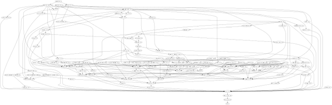

Figure 5.1: A graph containing all installed Haskell packages[1]

Also, we have seen that a typical system has multiple components that work together, e.g., a web server, a DB-server, a DB client, etc. Each of these components has its own history of development and different versions. The compatibility of the various versions of several components is another factor that adds to the complexity of the software program. Suppose you decided out of curiosity to create a VM instance with a different OS than the default Debian 10 that we used in chapter 4. In that case, there&#39;s no guarantee that you can use the same versions of the libraries we used. You&#39;ll have to play the puzzle game again to figure out which version of each component would be compatible with the other components as well as the operating system.

In addition to that, if you&#39;re creating the software, you&#39;d need to take care of its dependencies as you ship it through at least three different environments; the development, the testing, and the production environments.

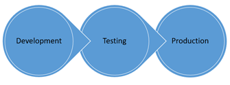

Figure 5.2: Software systems need to be shipped through at least three different environments

A well-known problem happens when some dependencies are missed during the movement between the environments, leading to the situation in which the system would be working in one environment but not the other.

The concept of the container was introduced to avoid this problem. Using containers, the software system is shipped as one unit containing the program and all its dependencies instead of shipping the individual pieces with the inevitable risk of missing one of them. The concept was borrowed from the physical containers that revolutionized the &#39;literal&#39; shipment industry by introducing a standard way of transporting goods, which explains the name and the logo of the most popular software container framework, [Docker](https://www.docker.com/).


Figure 5.3: Physical containers being shipped [2]

Another benefit of using containers (both physical and software) is that they isolate their contents from those in other containers and, therefore, enhance their contents&#39; security and modularity.

# 5.3 Containerization System

The containerization system has four main components: the container itself, the container image, the container runtime engine, and a container image registry.

## 5.3.1 Container runtime engine

The runtime engine is the environment in which the container is executed. It provides a decoupling layer that frees the container from any dependence on the operating system, similar to how the hypervisor decouples the operating system and the hardware and how the JVM decouples a Java program and the operating system.

Figure 5.4 demonstrates the difference between using virtualization versus containerization. Part (B) of the figure should be familiar since we explained the concept of virtualization in chapter 2. The only difference here is that we highlighted the libraries and dependencies that would be needed as part of the application&#39;s installation. Part (A) illustrates how containerization allows us to encapsulate the application&#39;s libraries and dependencies into containers. These containers are executed in the runtime environment. As you can see in the figure, not every application in the system needs to be containerized. Part (C) of the figure demonstrates that we can get the best of both worlds and install a container runtime engine on top of a virtual machine.

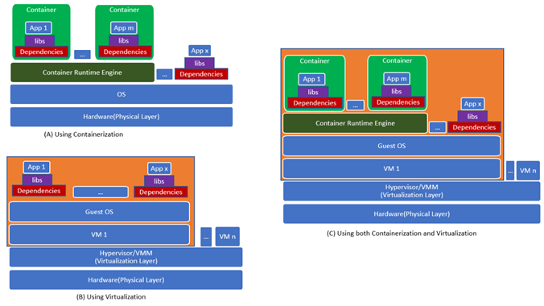

Figure 5.4: Containerization vs. Virtualization

### Docker Engine

Docker was originally created to work on Linux-based operating systems. Some distributions seem to work on Windows and Mac as well; however, these distributions actually include Linux-based virtual machines as part of their installation. So, you can install Docker on your local device to follow the examples in this chapter. However, to avoid any confusion that may arise due to working with different distributions, we&#39;ll work with a Google compute engine as our development/test environment.

1. Let&#39;s start by creating a compute instance with the default operating system &#39;Debian 10 (buster)&#39;, a Linux-based OS named &quot;docker-test-instance&quot;.
2. Open an SSH connection to that instance
3. Go to [https://docs.docker.com/engine/install/](https://docs.docker.com/engine/install/) and click on the link to &#39;Debian&#39; under the &#39;Server&#39; platform to see the installation instructions.
4. In the &#39;prerequisites&#39; section of the guide, we can verify that our OS &#39;Debian Buster 10&#39; is still supported.
5. In the &#39;Installation Method&#39; section, you can see that the guide provides instructions for several installation methods. Since we are installing Docker for testing and practicing purposes, we can perform the installation using the [convenience scripts](https://docs.docker.com/engine/install/debian/#install-using-the-convenience-script), so scroll down until you see the section titled &#39;Install using the convenience script&#39;.
6. Read the description and execute the curl command to download the script &#39;get-docker.sh&#39;, then run the sh command on it to execute it.
7. After the script is done, we can verify that the installation was successful by running the docker -v command that should print the current installation version, as shown in the figure below.

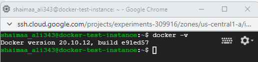

Figure 5.5: Docker engine successfully installed

The engine that we just installed has two components; a server component (a daemon) and a client component. The client is the command-line tool accessible through the command &#39;docker&#39;. The client takes another command (e.g., images) and sends it to the server. The server then executes that command and sends the output back to the client, which prints it in the terminal for the user to see.

## 5.3.2 Containers, Container Images and Containers Registry

Figure 5.6 demonstrates the process of working with containerized applications. Let&#39;s say that you&#39;re a developer and you would like to containerize your application; you&#39;d need to &#39;build&#39; a _ **&#39;container image&#39;** _ that encapsulates the application&#39;s libraries and dependencies. Every time you &#39;run&#39; your containerized application, a new _ **container** _ will be created as an instance of that image in order to be executed. If you want to make your container image available for others to use, you can &#39;push&#39; it to a _ **&#39;registry&#39;** _, which is a database for container images. If someone wants to use your application, they can &#39;pull&#39; (i.e., download) its container image from the registry, and then whenever they wish to &#39;run&#39; the application, a container will be created based on that image.

The words highlighted by red color are also docker commands that we&#39;ll practice using in the coming sections.

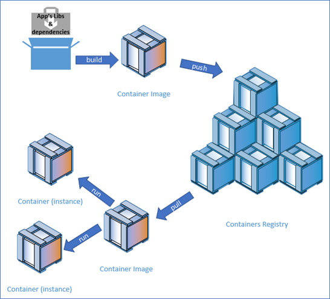

Figure 5.6: Containers, Images, and Registry

Public registries allow developers and companies to make their container images available to the public. For example, [Docker Hub](https://hub.docker.com/) is a public registry provided by Docker.  Private registries allow developers and companies to share their images with specific users. If you want to have a private registry, you can use one available through service providers or install your own. In fact, one of the images available on docker hub is called &#39;registry&#39;, which is a registry program that you can pull and use locally.

# 5.4 Exercises

## 5.4.1 Pulling and running an image from Docker&#39;s hub

Go to [Docker Hub](https://hub.docker.com/) and click on the &#39;Explore&#39; link; you&#39;ll see a wide variety of container images. We will start with one of the most straightforward containers named [&#39;hello-world&#39;](https://hub.docker.com/_/hello-world).

1. Open an SSH connection to &#39;docker-test-instance&#39;.
2. To download an image from Docker&#39;s hub, we need to issue the command docker pull \&lt;image-name\&gt;; running this command requires &#39;superuser&#39; privileges, so we also need to precede it by &#39;sudo&#39;. So the final command to execute should be:
`$ sudo docker pull hello-world`
3. Figure 5.7 below shows the output after running the pull command. There are a few things to note about the last line of that output:

- **docker.io;** this is the address for docker-registry; since we didn&#39;t specify any other registry, the pull command looks for the requested image in docker&#39;s public registry.
- **library;** this is the name of the &#39;home&#39; repository that contains the image. Again because we didn&#39;t specify any other repository, the pull command looks for the image inside the general repository named &#39;library&#39;. Docker (the company) manages this repository, so it&#39;s read-only for everyone, except for those authorized by Docker.
- **hello-world;** the name of the repository that contains all the versions of the image.
- **latest;** what comes after the colon (:) is the tag that indicates the version of the image that we would like to download, and one more time, because we didn&#39;t specify the tag in the command, by default, it would be set as &#39;latest&#39;, which stipulates the latest version of the image.

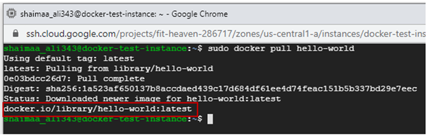

Figure 5.7: pulling hello-world container image

4. In order to list all the images that we have locally, we can use the `images` command
   `$ sudo docker images`
    As you can see in figure 5.8, we only have that one container image that we just pulled.

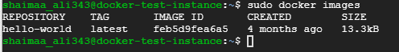

Figure 5.8: Local docker images

5. To create a container based on that image and execute it, we need to issue the `run` command and give it the image name:
`$ sudo docker run hello-world`
 You can see the output starts with the &quot;Hello from Docker!&quot; message, then illustrate the purpose of having this image available, which is to verify that our docker installation was done correctly and all the listed steps were executed with no problems. We are going to follow the suggestion of trying something more ambitious shortly after examining the container created by listing it using the ps command in the next step.

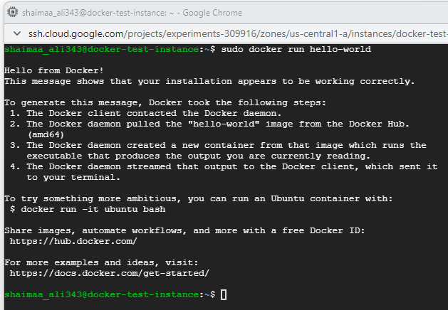

Figure 5.9: creating and executing a container

The `ps` command, without any options, is used to list the containers "running" on the system. If we tried it, we wouldn&#39;t see any containers running because the image we just executed was terminated right after it finished executing the program it encapsulates. However, the `-a` option of the ps command allows us to see all containers regardless of whether they are running.

6. Before issuing the ps command, let&#39;s create and execute another container based on the hello-world image by reissuing the run command $ sudo docker run hello-world
7. Figure 5.10 shows the output of the command $ sudo docker ps, which is an empty list as expected, followed by the output of the command $ sudo docker ps -a. As you can see, every time we issue the run command, a new container is created, and it&#39;s given a unique id (the first column) and a unique name (the last column).

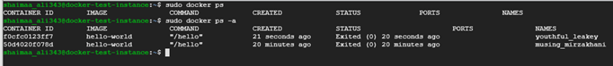

Figure 5.10: Listing containers

Now, let&#39;s try working with the ubuntu image suggested by hello-world&#39;s message. We don&#39;t have this image downloaded; however, when we issue the &#39;run&#39; command on an image that doesn&#39;t exist locally, Docker will automatically pull the image and then create the container and execute it.

So, let&#39;s run the command $ sudo Docker run ubuntu, and see what happens. We should expect to see that the image was downloaded and a container was created based on that image. As we can see in figure 5.11 below, when we list the images, the ubuntu image exists, and a container based on that image is listed with the status &#39;Exited&#39; as well.

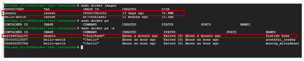

Figure 5.11: Ubuntu image and container

- This container terminated so quickly because the image contains only the operating system &#39;ubuntu&#39; with no specified command to run any program on it.
- The only reason for a container to exist is to run a specific program/process on the operating system then terminate right after that process finishes.
- We can specify a program we want to execute on the OS inside the container as part of the run command.

For example, the command that we are going to try next creates the container and runs the sleep program, which keeps waiting for the specified number of seconds before it ends.

`$ sudo docker run -d ubuntu sleep 15`

- The sleep program will run for 15 seconds.
- The &#39;-d&#39; option runs the program in a &#39;detached&#39; mode (i.e., in the background) so that we can get the terminal back to be able to see how this container is listed.
- If we run the ps command within 15 seconds after running the container, we should be able to see that its status is &#39;Up&#39;.
- If you want to stop this container, you need to issue the stop command and give it the first few characters of the id, for example, $ sudo docker stop 66e

The sleep program doesn&#39;t give so much value in itself; however, the objective of this exercise is to get familiar with a base OS container image. Any container image must have a base OS image to build on, either directly or indirectly.

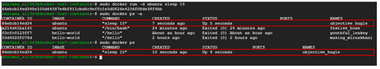

Figure 5.12: Ubuntu sleep running in the background

## 5.4.2 Building an image and pushing it to a registry

In the previous exercise, we sent the command to be executed in the container with the run command. Now, we are going to create a new image that includes the command we want to be executed automatically as part of running the container. For example, the program that we want to execute is the &#39;echo&#39; command that prints &#39;Hello From \&lt;Your Name\&gt;&#39;  on the terminal.

1. Start the &#39;docker-test-instance&#39; VM
2. Open an SSH connection to the VM
3. Create a directory named hello-from-me $ mkdir hello-from-me
4. Step inside that directory $ cd hello-from-me
5. Create a text file named Dockerfile to contain the specification of the image we are about to create $ touch Dockerfile

The Dockerfile would contain any number of lines with the format &#39;INSTRUCTION arguments&#39; you can find all valid instructions and examples of how to use them in the [Dockerfile reference](https://docs.docker.com/engine/reference/builder/#:~:text=A%20Dockerfile%20is%20a%20text,can%20use%20in%20a%20Dockerfile%20.). In our simple example, we&#39;ll only use two instructions, &#39;FROM&#39; that allows us to specify the base container and &#39;CMD&#39; that allows us to specify the command we want to execute.

1. Open the dockerfile for editing  `$ vi Dockerfile`
2. Press &#39;i&#39; on the keyboard to start the &#39;insert&#39; mode and insert these two lines

```
  - FROM ubuntu
  - CMD echo "hello from <your-name>";
```
1. Press &#39;ESC&#39; on the keyboard and then type :wq to save the file and exit
2. To build the image, we need to issue the Docker build command and specify the directory that includes all the files to be encapsulated in the container and the Dockerfile.
  - Since we are already inside that directory, we&#39;ll use the dot (.) to specify the current file.
  - The --tag option allows us to specify a name and a tag for the image we&#39;ll be creating; in the command below, we only specified the name and left the tag empty, so it&#39;ll take the default value &#39;latest&#39;.
    `$ sudo docker build --tag hello-from-me .`
3. Building this image shouldn&#39;t take long because we already have the ubuntu image pulled beforehand. If we didn&#39;t have that image locally, Docker would have pulled it automatically as part of the build command.
4. You can see the output of the build command in figure 5.13 below.

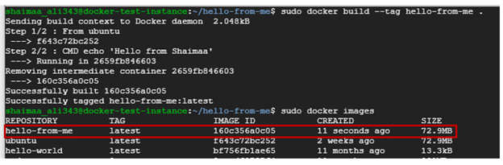

Figure 5.13: Building hello-from-me image

1. You can also see in figure 5.13 that the image we just created is listed under the local images.
2. Now that we have an image, we can create containers based on it and execute them using the docker run command, as shown in figure 5.14 below.
3. Not surprisingly, the container created based on the hello-from-me image would be listed if you run docker ps -a command.

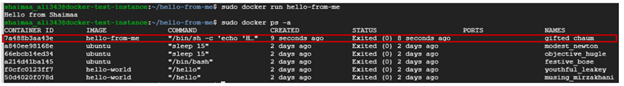

Figure 5.14: Running hello-from-me container

In order to make this image available for others to use, or to be available for deployment in another environment, we need to push it to a registry. In the steps below, we&#39;ll push our image to docker hub.

1. Go to [https://hub.docker.com/](https://hub.docker.com/)and create an account.
2. Login using the Docker ID you just created.
3. Create a public repository with the name of the image. In this exercise, the name should be &#39;hello-from-me&#39;.
4. Go back to the terminal of &quot;docker-test-instance&quot;.
5. Create a tag for the image that includes your Docker ID using the docker image tag command

  `$ sudo docker image tag <image-name[:tag]> <your-account-repo> <project-repo>`

    my command would look like this
 
  `$ sudo docker image tag hello-from-me shaimaaali/hello-from-me`

6. If you list the images, you can see that two lines appear for images with the same ID but with a different value under the repository column.

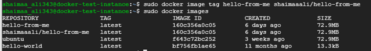

Figure 5.15: Preparing the image to be pushed to docker.io

1. Login to docker hub using the command
   `$ sudo docker login -u <your_username> -p <your_password>`
2. Push the image to the registry using the command
   `$ sudo docker push docker.io/shaimaaali/hello-from-me`
3. You should be able to see the image on the repository&#39;s page on docker hub
4. Now anyone can pull that image and run containers based on it. You can pull it into another VM instance to see it running in another environment. You can also pull someone else&#39;s image to your instance.

## 5.4.3 One step further

In the previous exercise, we built an image directly on a base OS image. Now let&#39;s take it one step further. One of the images available on Docker hub is called &#39;node&#39;, which contains Node.js, the JavaScript runtime environment. When we get to build our image, we don&#39;t have to start at the OS because it&#39;s already encapsulated within the &#39;node&#39; image. So you see, containers are built as _**layers**_ stacked on top of each other.

1. Open an SSH connection to the instance &#39;docker-test-instance&#39;.
2. Create a directory called &#39;hello-i-am-here&#39;.
3. Step inside that directory using the cd command.
4. Create a file named &#39;index.js&#39;.
5. Write (or copy &amp; paste) the code given in listing 5.1 below into this file.

```
    const express = require('express');
    const os = require('os');

    const server = express();
    server.get('/', (request, response) => 
                    {
                        response.send("Hello "+request.query.name 
                                              + " I'm here at "
                                              +os.hostname + "\n");
                    }
              );
    server.listen(8080, '0.0.0.0', () => {console.log('listening on port 8080.');});

```
Listing 5.1: Code for hello-i-am-here app

In this script, we created a small web application using &#39;express&#39; the JS webserver framework. The application listens for HTTP requests on port 8080; the request is expected to have a query string with a parameter called &#39;name&#39;. It then sends a response saying &#39;Hello&#39; to the given name and indicates where the app is running by sending the hostname.

This application has two dependencies that need to be specified and installed before it can run. Dependencies of Node.js applications are stored in a file named package.json, so we&#39;ll need to create this file as part of our application.

1. Create a file with this name and write the following JSON object in it.

```
      {
        "name": "hello-i-am-here",
        "main": "index.js",
        "dependencies": {
          "express": "^4.17.1",
          "nodemailer": "^6.4.17",
          "os": "^0.1.1"
        }
      }
```
Listing 5.2: package.json file for hello-i-am-here app

1. Create a Dockerfile with the following instructions.

```
    From node:latest 
    WORKDIR /usr/src/web-apps/hello-i-am-here 
    ADD index.js . 
    ADD package.json . 
    RUN npm install 
    EXPOSE 8080 
    ENTRYPOINT ["node" , "index.js"]
```

Listing 5.3: Dockerfile for hello-i-am-here app

2. We can now build the image using the following command `$ sudo docker build --tag hello-i-am-here .`

    - This time, we will not pull the image beforehand; we&#39;ll leave the build command to do that for us
    - You&#39;ll notice that it needs more time to build the image because it first needs to pull the node image.
    - Check whether the image was created using the command
    `$ sudo docker images`

Before we run the container, we need to understand something important. Normally, the host of the webserver is the machine that it runs on. For example, I ran the &#39;hello-i-am-here&#39; app on my local machine, which happens to be a Windows machine. When I sent a request to the app using the curl command, I sent it to the host&#39;s 8080 port directly, and the app responded with the name of my windows machine as the hostname. 

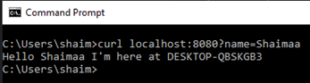

Figure 5.16: hello-i-am-here running locally

However, when we run the app within a Docker container, the container acts as a host within the host. The VM instance is the outer host, and the container is the inner host.When we send the request, it will be received at the port of the outer host, so we need to specify in the run command that we would like to map a port of the **outer host** (i.e., the host of the container) to the port of the **inner host** (the container). The -p option is used for this purpose.One more thing to pay attention to; the code running in the container doesn&#39;t know anything about the outer host. The container is the only host that it knows about, so when it responds with the hostname, it&#39;ll send the container&#39;s ID. Let&#39;s try that out and see how it works.

1. In addition to the -p option, will also use the -d option to let the server run in the background 
   `$ sudo docker run -d -p 8080:8080 hello-i-am-here`
2. In the figure below, we can see the information about the running container using the command `$ sudo docker ps`
3. We can also see that when we send the request to the app using the command
   `$ curl localhost:8080?name=Shaimaa`
 the response has the container&#39;s ID as the hostname.

 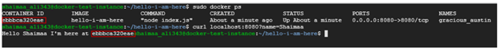
 
 Figure 5.17: running hello-i-am-here container

4. You can see the messages sent to the log, as well as any error message, by running the command 
  `$ sudo docker logs <container-ID>`
5. You can stop the running container using the command $ sudo docker stop \&lt;container-ID\&gt;
Now let&#39;s push the image to docker-hub so that we can use it in the next chapter. We&#39;ve already gone through the steps in the previous exercise, so we&#39;ll not repeat them here.

# 5.5 Summary
In this chapter, we touched upon the basics of containerization with introductory hands-on exercises to understand the basics that would give you enough foundation to help you dive more deeply into the subject if you choose to. We started by explaining the concept of the container and how it is used to facilitate the software development process by encapsulating the program and all its dependencies into one unit that&#39;s easy to ship and deploy. Then we introduced the popular containerization framework &#39;Docker&#39; with hands-on exercises.

# Relevant lab\(s\) on Qwicklabs

- [Introduction to Docker](https://www.cloudskillsboost.google/focuses/1029?parent=catalog)
# Image Credits
[1][Image](https://commons.wikimedia.org/wiki/File:A_graph_containing_all_installed_Haskell_packages.svg) by [Adam majewski](https://commons.wikimedia.org/wiki/User:Adam_majewski), [CC BY-SA 4.0](https://creativecommons.org/licenses/by-sa/4.0) \&lt; \&gt;, via Wikimedia Commons 

[GCP Screenshots] &quot;Google and the Google logo are registered trademarks of Google LLC, used with permission.&quot;Unless otherwise stated, all Images in this chapter created by the author Shaimaa Ali using either MS PowerPoint or MS Visio or both. Code screenshot made using MS VSCode.

© Shaimaa Ali 2022