# **Chapter 6: Container-based Deployments using Kubernetes Orchestration**

**Abstract**

In this chapter we&#39;ll explore the basic concepts needed to understand container-based deployments using an orchestrator like Kubernetes 

# 6.1 Learning Outcomes
By the end of this chapter the reader should be able to:
- Recognize the concept of container orchestration.
- Recognize the popular container orchestrator &#39;Kubernetes&#39;.
- Create a Kubernetes cluster.
- Deploy containerized applications to Kubernetes clusters.

# 6.2 Containers Orchestration

Once the container is in a registry, it can be deployed to any environment without worrying about the dependencies. Simple deployment can be done by installing docker in the production environment. More sophisticated deployments, including auto-scaling and replication, would require a container orchestrator like Kubernetes.

In other words, a simple deployment may involve creating another VM to be used as the production environment, installing docker on it, pulling the image into it, and running a container based on this image. However, in reality, one VM might not be enough for a real production environment. Multiple VMs could be needed to host different containers for different system components.

For example, you can have a container for the webserver component and another container for the database server, each hosted in a different instance. In addition to that, multiple VMs could be needed to replicate containers for the sake of scalability or availability. For example, you may need to replicate that DB container so that if the main DB server failed another replica can take its place without causing any disruption for the system, or you may need to replicate the webserver container in order to distribute the access load among several servers, in that case, you would also need a load balancer that would receive and distribute the requests among all the replicas.

Can you imagine creating all the needed instances one by one, installing docker, pulling the corresponding images, running the containers on each of them, and installing and configuring the load balancers and the replications whenever needed? Then, after you&#39;ve done all that, you would need to manage your software updates in all the replicas.

Thanks to container orchestrators&#39; existence, you don&#39;t have to do all of that manually; the orchestrator automates all these tasks for us and more.

# 6.3 Kubernetes Concepts and Building Blocks

Kubernetes is the most popular container orchestrator. Google created it as an enhancement of its predecessor [Borg](https://kubernetes.io/blog/2015/04/borg-predecessor-to-kubernetes/)that they used internally for several years.

In addition to the powerful features drawn from several years of experience with Brog, another factor contributing to the wide popularity of Kubernetes is its availability as an open-source after Google donated it to the Cloud Native Computing Foundation (CNCF), which is a part of the Linux Foundation.

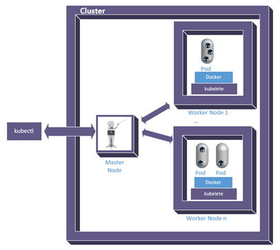

Figure 6.1: Kubernetes framework

Here are the main concepts we need to understand to be able to work with Kubernetes.

**Nodes;** one of the main building blocks in a Kubernetes system is the node, which corresponds to a machine/device, either physical or virtual. A node can be one of two types, either &#39;Master&#39; or &#39;Worker&#39;. A _master_ node is responsible for receiving instructions and communicating them to the _worker_ nodes.

**Cluster;** A cluster is a group of nodes used for a specific deployment, with one of them being the master and the rest being workers.

**Pod;** A pod encapsulates one or more containers that need to co-exist to work together all the time. Even though the main purpose is to keep dependent containers together and move them around as one unit, a single container still needs to run within a pod.

**Kubectl;** Is the software tool that allows us to communicate with the master node in a Kubernetes cluster.

**Kubelet;** Is the software tool that acts as the worker node agent and receives instructions from the master node in order to execute them on the worker node.

**Service;** A service allows several replicas of the containers running within the cluster to be seamlessly accessible from the outside world without revealing the details of the actual hosting settings.

Kubernetes itself is a software framework that can be installed and run on any computer system, so it&#39;s not specific to the cloud; however, the flexibility and elasticity available on cloud platforms make the orchestration job much more efficient. Several cloud providers, including GCP, provide services to automatically provision the needed instances with the all the required platforms like Kubernetes and Docker already installed. That&#39;s why I like to argue that Kubernetes services are just a special type of PaaS.

# 6.4 Example container deployment using Kubernetes

Let&#39;s understand how container orchestration using Kubernetes works through a hands-on exercise.

## 6.4.1 Creating a cluster

1. Go to GCP console.
2. In the navigation menu, click on &#39;Kubernetes Engine&#39;.

    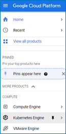

    Figure 6.2: Google Kubernetes Engine (GKE) Service

3. Generally, whenever we try to use a service for the first time on GCP, it&#39;ll ask us to enable the API of that service first. So, if this is the first time you open the Kubernetes service page, you&#39;ll see a dialogue that asks you to enable the Kubernetes Engine API in the project, click &#39;ENABLE&#39;, then click &#39;CREATE&#39; in the &#39;Kubernetes clusters&#39; dialogue.

    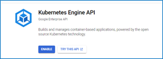

    Figure 6.3: Enable Kubernetes Engine API

    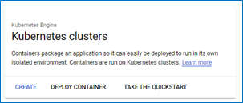

    Figure 6.4: GKE clusters

4. There are two modes of operation that we can choose from. Using the standard mode, we&#39;d be responsible for the cluster&#39;s configuration (e.g., scalability options), and we pay per node. Using the recently added autopilot mode, the GKE will automatically manage the configuration for optimal usage. For the sake of this exercise, we&#39;ll chose the standard option.

   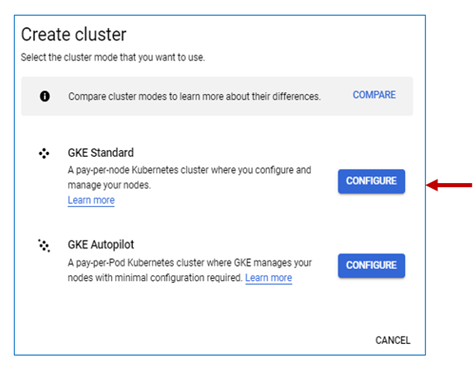

   Figure 6.5: GKE modes of operation

5. The cluster set-up page will open to allow us to configure the settings for the cluster we are about to create. You can click on any of the links on the side panel to change the specified configuration. However, since we&#39;re only experimenting, we can follow the suggestion in the note on the page and create an affordable cluster using the set-up guide pointed at by the arrow in figure 6.5.

   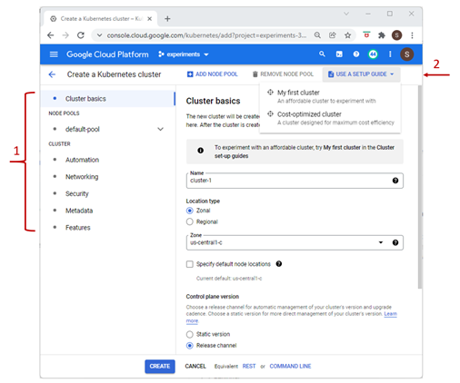

   Figure 6.6: Kubernetes cluster setup

6. Have a look at the suggested settings, then click on &#39;CREATE NOW&#39;.

   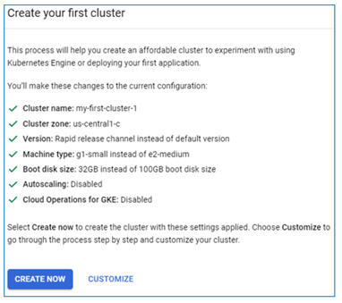

   Figure 6.7: Settings for experimental clusters

7. Once the cluster is provisioned, you can see it listed under the Kubernetes clusters with the name &#39;my-first-cluster-1&#39; and the default size of 3 nodes.

   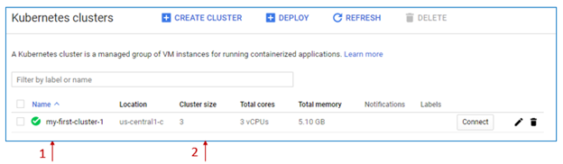

   Figure 6.8: First Kubernetes cluster provisioned

8. If you go to the VM instances page under the &#39;Compute Engine&#39; page, you can see three instances with the prefix &#39;gke&#39; created and running. The &#39;In use by&#39; column indicates that the instance is part of the cluster&#39;s pool.

   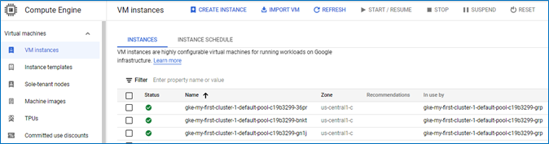

   Figure 6.9: VM instances created as cluster nodes

9. Open an SSH connection to any of them and run the command $ docker -v then the command `$ kubelet –-version` to verify that they were installed automatically as part of the cluster setup. You should see the output similar to what is shown in figure 6.10 below.

   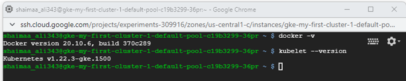

   Figure 6.10: Verifying a node&#39;s setup

We are now ready to deploy our &#39;hello-from-me&#39; containerized app and see what it would look like on the cluster.

## 6.4.2 Deploying the container to the cluster

In the following steps, we will prepare the environment needed for Kubernetes deployment by installing and configuring kubectl.

1. Go to the &#39;VM instances&#39; page on GCP&#39;s console.
2. If you have docker-test-instance running, stop it because we need to change the access scope setting
3. Click on the instance name to open the details page, then click edit
4. Scroll down to the &#39;Access Scope&#39; section
5. Select the &#39;Allow full access to all Cloud APIs&#39; option, then click &#39;Save&#39;.
6. Go back to the &#39;VM instances&#39; page, start the &#39;docker-test-instance&#39; VM, and open an SSH connection.
7. Install kubectl using the command $ sudo apt-get install kubectl
8. Verify that the installation was successful by running the command $ kubectl version. The output of the command should look similar to what you see in figure 6.9. Notice that the output indicates that what we&#39;re viewing is the client component and that the server is not accessible. We didn&#39;t configure kubectl to connect ot a server yet, so this should be a surprise.

   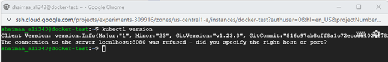

   Figure 6.11: Verifying kubectl installation

9. For kubectl to access the cluster, it needs to have proper credentials. The following command fetches the credentials needed to access the cluster and updates the configuration for kubectl to know them. In this exercise the zone-name is &#39;us-central1-c&#39; and the cluster-name is &#39;my-first-cluster-1&#39;. The output should indicate that a configuration entry was created

   `$ gcloud container clusters get-credentials --zone <zone-name> <cluster-name>`

   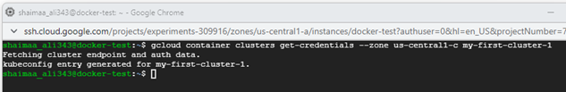

   Figure 6.12: Verifying kubectl installation

**Note:** You may wonder why the command starts with &#39;container&#39; instead of &#39;kubernetes&#39; or even &#39;orchestrator&#39;. It&#39;s because Kubernetes used to be called &#39;Container Engine&#39;.

In the following set of steps, we will create a **deployment** and look into the cluster nodes to see how it happened.

1. The following command instructs Kubernetes to pull the image from docker hub and run the container on one pod

    `$ kubectl create deployment <deployment-name> --image= <container-image> --port 8080`

    So, if we want to deploy the container image we created in chapter 5 using Kubernetes, and we decided to give the deployment the name &#39;hello-deployment&#39;; the command should look like this:

    `$ kubectl create deployment hello-deployment --image= docker.io/shaimaaali/hello-i-am-here --port 8080`

2. The following command displays the available pods. $ kubectl get pods
3. It might take some time before the pod is ready, so if under the &#39;Ready&#39; column, you see &#39;0/1&#39;, it means that we have one container in this pod, but it&#39;s not ready yet. Re-run the command again after a few moments to see if it&#39;s ready; the value under the status column should be &#39;Running&#39; then.

   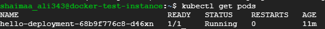

   Figure 6.13: One pod deployed to the cluster

4. The application in the image is a web application that listens to requests coming through port 8080, so we need to tell Kubernetes to expose that port in the cluster. In that, we would be creating a &#39; **service**&#39; with a load balancer that redirects the requests it receives to the port 8080 of the nodes which is sent to the pod, then finally to the hosted containers.

    `$ kubectl expose deployment <deployment-name> --type=LoadBalancer --port 8080`

5. You can see the exposed services if you run the command `$ kubectl get services`

   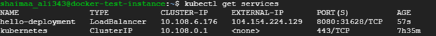

   Figure 6.14: Available Kubernetes services

6. If you open the browser from any computer and type http://\&lt;extenral-ip\&gt;:8080?name=\&lt;your-name\&gt;, you should be able to see the message sent by the app as the response in the browser with the pod&#39;s name as the hostname this time.

   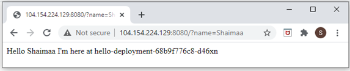

   Figure 6.15: Sending a request to the Kubernetes service

7. If you go to the GCP console, open the side navigation menu, under &#39;Network Services&#39;, click on &#39;Load Balancing&#39;. You&#39;ll see that the load balancer was created automatically. Click on it to open the details, and you&#39;ll see that the cluster&#39;s nodes were set as the backend of that load balancer.

   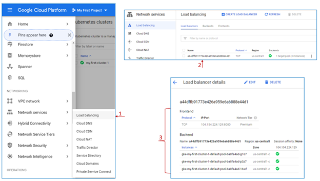

   Figure 6.16: A Load Balancer created automatically for the Kubernetes service

8. Right now, we deployed the container in only one pod, replicating that deployment doesn&#39;t take more than one command line

   `$ kubectl scale deployment <deployment-name> --replicas=<Number of replicas>`

   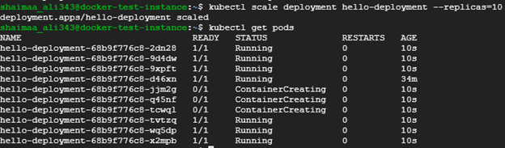

   Figure 6.17: Scaling Out the deployed application by creating 10 replicas

9. Once all the pods are ready and running, we can send requests to the service, and the load balancer will direct these requests to the different replicas, which can be verified when you see the response coming with different hostnames.

   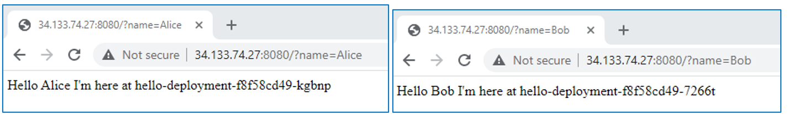 

   Figure 6.18: The Load Balancer directs the requests to the replicas

# 6.5 Summary

In this chapter, we learned the basics of container-based deployment using the most popular container orchestrator Kubernetes.

# Relevant lab\(s\) on Qwicklabs 

- [Orchestrating the Cloud with Kubernetes](https://www.qwiklabs.com/focuses/557?catalog_rank=%7B%22rank%22%3A1%2C%22num_filters%22%3A0%2C%22has_search%22%3Atrue%7D&parent=catalog)
# Image Credits

[1] [Image](https://commons.wikimedia.org/wiki/File:Wikibase_RL_dependency_graph_new.png) by [Amir Sarabadani (WMDE)](https://commons.wikimedia.org/wiki/User:Amir_Sarabadani_(WMDE)) is licensed under [CC BY-SA 4.0](https://creativecommons.org/licenses/by-sa/4.0/deed.en). 

[2] [&quot;Rio de la Plata outward bound on the River Thames&quot;](https://www.flickr.com/photos/40686262@N05/5867859196) by [L2F1](https://www.flickr.com/photos/40686262@N05) is licensed under [CC BY 2.0](https://creativecommons.org/licenses/by/2.0/?ref=ccsearch&amp;atype=rich).

[GCP Screenshots] &quot;Google and the Google logo are registered trademarks of Google LLC, used with permission.&quot;

Unless otherwise stated, all images in this chapter were created by the author Shaimaa Ali using either MS PowerPoint or MS Visio or both. Code screenshot made using MS VSCode.

© Shaimaa Ali 2022
