# **Chapter 7: DevOps and Cloud Deploymnets**
# 7.1 Learning Outcomes
By the end of this chapter the reader should be able to:
- Recognize the concept of DevOps
- Recognize the concept of Continues Integration
- Recognize the concept of Continues Delivery/Deployment
- Recognize the different CD strategies
- Implement CD strategies using GKE

# 7.2 Introduction to DevOps

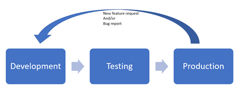

Figure 7.1: IT/Maintenance Cycle

The traditional approach to handle the IT/maintenance cycle would involve (at least) three separate environments handled by separate teams. So, the development team would create the software then send it to the testing environment for the testing team to test. If everything goes well, it would be deployed to the production environment by the operations team. A Request for a new feature or a bug fix would have to go through the whole cycle and wait for the next planned release before the end-user can see the change, which often takes much longer than it needs to. In addition to that, the separation between the teams made the process even slower and more error-prone.

The DevOps (Development/Operations) approach aims at minimizing the time needed for the end-user to see the changes they requested and make the whole process less error-prone through:

- Creating one environment that includes the three (or more) stages connected by an automated chain of actions known as the _**DevOps Pipeline**_. It&#39;s important to note that the testing stage is not eliminated in the DevOps approach. However, all the environments are seamlessly integrated through automation.

- Creating cross-functional teams that involve individuals with expertise in the various stages.
- The introduction of the DevOps engineer role that helps to facilitate the communication between the individuals with different expertise as well as the creation and maintenance of the DevOps pipeline.

## 7.2.1 Continuous Integration and Continuous Deployment/Delivery (CI/CD)

The DevOps pipeline involves automated actions that support continuous (i.e. frequent) integration of new changes into the existing application (contingent that these new changes pass all the automated testing) and the deployment/delivery of the new version of the application to production.

Some resources distinguish between the deployment and delivery terms by suggesting that the delivery involves having the application ready for deployment without actually deploying it to production. However, we&#39;re not going to make this distinction here, and we&#39;ll treat the two terms as synonyms.

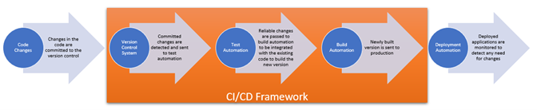

Figure 7.2: Artifacts needed for DevOps Pipeline

In general, a CI/CD pipeline would involve several artifacts and a framework that links them all and automatically triggers the action needed at each stage. For example, the process begins after some changes are committed to a version control system (e.g. Git), the CI/CD framework (e.g. Jenkins) would detect the changes and trigger the automated tests to begin. If the changes pass the tests, the CI/CD framework would trigger the build automation tool (e.g. Docker); finally, the framework would trigger the deployment automation tool (e.g. Kubernetes) and send the new version to production.

It might sound scary to have the production deployment so frequently (every day in some cases). However, as we&#39;ll see later in this chapter, it&#39;s not as risky as it seems to be since there are strategies and mechanisms for gradual deployments with the ability to bail and go back to the previous version if anything goes wrong

## 7.2.2 How is that related to cloud computing?

The existence of cloud computing services and mechanisms contributed significantly to the feasibility and the quality of creating DevOps pipelines, and hence, the popularity of the DevOps culture in general. You can find a cloud service for each of the artifacts needed in the pipeline, as well as the means to install and connect them to a framework like Jenkins.

Since this book focuses on software deployments on the cloud, we&#39;ll focus on the **Continues Deployment** aspects in the rest of the chapter.

# 7.3 CD strategies with Kubernetes

In this section, we will recreate the deployment of the hello-I-am-here application we used in previous chapters to exercise working with three popular CD strategies: rolling deployments, canary deployments, and blue-green deployments.

## 7.3.1 Creating Kubernetes objects using a YAML file

In chapter 6, you learned how to create a Kubernetes deployment directly through the command line, which would be sufficient for simple deployments. However, as the deployment grows in complexity, using direct commands becomes less efficient and more error-prone. Luckily, there&#39;s a more convenient way to create deployments by specifying the configuration in a [YAML](https://yaml.org/) file. In fact, YAML files can be used to create any Kubernetes objects, not just the deployments.

YAML syntax includes two main structures that can be used to create any configurations we want: maps and lists. The _**map**_ is basically a key-value pair separated by a colon (:) (key: value), which corresponds to the _**property**_ in JSON format. The _**list**_, which is equivalent to the _**array**_ in JSON format, is just a list of values in separate lines, each starting with a dash, as shown below:

```
 - value1
 - value2
 - value3
```

The value of a map can be a simple value, one or more other maps or a list. Also, each of the values of the list can be a simple value, a map or another list. Nested structures are indicated by indentation using any number of spaces (tabs are not allowed, so be careful if you are using an editor like notepad++ as it can automatically replace 4 spaces for indentation with a tab).

The YAML specifications are stored in a plain text file with the extension (.yaml), which is processed by any program that can process the syntax and recognize the map keys and values.

In our context, Kubernetesis the program that will process the YAML file, and it expects to see [descriptions of Kubernetes objects](https://kubernetes.io/docs/concepts/overview/working-with-objects/kubernetes-objects/) there. There are four mandatory properties (maps) that are expected to be included in the YAML file:

- apiVersion – The version of the Kubernetes API we need for this configuration.
- kind – The type of object we want to create (e.g. deployment, service, pod, … etc.)
- metadata – Contains sub-properties to identify the object, e.g. name and labels
- spec – The actual specification of the object we are trying to create. The details of the specifications differ from object to object according to the [Kubernetes API Reference](https://kubernetes.io/docs/reference/kubernetes-api/).
   - We are going to start by creating a deployment, so we need to look at its page in the reference here: [https://kubernetes.io/docs/reference/kubernetes-api/workload-resources/deployment-v1/](https://kubernetes.io/docs/reference/kubernetes-api/workload-resources/deployment-v1/)
   - The documentation indicated that there are two required sub-properties for the deployment&#39;s specproperty;
      - selector, which is a criterion to filter and select the pods that belong to this deployment,
      - template, which contains the configuration of the container(s) to be deployed. The template itself has its own spec property under which the list of containers are specified
   - The replicas property (not required) can be used to specify the number of replicas for the deployment (defaults to 1 if omitted)

The listing below shows an example YAML specification to create a deployment similar to the one we created in chapter 6. Please note that I added a v1 tag to the container image to be able to easily see the effect when we change the version of the application.

```
apiVersion: apps/v1
kind: Deployment
metadata:
    name: yaml-test-deployment
spec:
    selector:
        matchLabels:
            app: hello-i-am-here
    replicas: 1
    template:
        metadata:
            name: yaml-test-pod
            labels:
                app: hello-i-am-here
        spec:
            containers:
                - name: yaml-test-container
                  image: shaimaaali/hello-i-am-here:v1
                  ports:
                      - containerPort: 8080

```
Listing 7.1 Example YAML file for Kubernetes Deployment Object

### Exercise 1: Creating the initial deployment

In this exercise, we&#39;ll create a cluster, a deployment and a service similar to the ones we created in chapter 6 for the sake of comparison

1. Let&#39;s say we don&#39;t want the user to send the name in the request anymore. If we just omit it from the querystring, the response message would print &#39;undefined,&#39; which we can consider a bug

   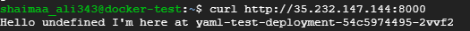

   Figure 7.3: found/introduced a bug in the application

2. To fix this bug by updating index.js file as shown in listing 7.3

    ```
    const express = require('express');
    const os = require('os');

    const server = express();
    server.get('/', (request, response) => 
                    {
                        response.send("Hello "
                                                + " I'm here at "
                                                +os.hostname + "\n");
                    }
                );
    server.listen(8080, '0.0.0.0', () => {console.log('listening on port 8080.');});

    ```

   Listing 7.3: Updating the code in inde.js of the hello-i-am-here app

3. Now we just need to rebuild the image; with a v2 tag to distinguish it from the previous version and push it to the registry.

    ```
    $ sudo docker build --tag shaimaaali/hello-from-me:v2 . 
    $ sudo docker login -u <your_username> -p <your_password>
    $ sudo docker push shaimaaali/hello-from-me:v2
    ```  
   We should be able to see the new image in the registry

   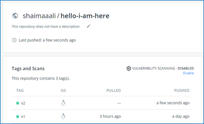

   Figure 7.4: Two containerized versions of the hello-i-am-here app

4. Start the VM instance, which has kubectl already installed docker-test-instance.
5. This time we&#39;ll create the cluster via gcloud for a change, the command below creates a cluster named yaml-test with 2 nodes in us-central1-a

    `$ gcloud container clusters create yaml-test --num-nodes 2 --zone us-central1-a`

   After the creation of the cluster is completed, we should receive a confirmation message, as shown below.

   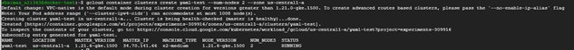

   Figure 7.5: Cluster created through command line

6. Create a file with a name that ends with .yaml extension and include the specifications provided in listing 7.1.
7. In order to create the deployment, we can use the command 

    `kubectl create -f <file.yaml>` or  `kubectl apply -f <file.yaml>` 

   here we&#39;re going to use apply since it can be used to update the configurations as well.

8. We can see in the figure below that the deployment and the pod were created as expected.

   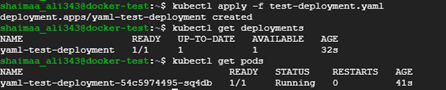

   Figure 7.6: Deployment and pod objects created using a YAML file

9. Now let&#39;s create a service. Just like the deployment, a service is a Kubernetes object that can be described and created using a YAML file.

   - The pods used for this service will be selected using the value of the selector property, so this value needs to match the label we specified in the template&#39;s metadata.
   - The ports list specifies all the ports configuration for the service. The targetPort is the port that&#39;s exposed by the container/the pod, which needs to match the port number that the application is listening at, while the port property is the port number we want the service to listen at (i.e. for the requests received from the outside world).

      ```
        kind: Service
        apiVersion: v1
        metadata:
          name: yaml-service
        spec:
          selector:
            app: hello-i-am-here
          type: LoadBalancer
          ports:
            - protocol: TCP
              port: 8000
              targetPort: 8080
      ```
      Listing 7.2 Example YAML file for Kubernetes Service Object

10. Suppose we want to change anything about the objects we created. In that case, we can either change the object directly (e.g. `kubectl edit deployment <deployment-name>`) or edit the YAML file then re-issue the `kubectl apply -f` command. The first approach may seem faster ; however, it&#39;s not recommended since it&#39;d create discrepancies between the actual objects and the YAML files, so let&#39;s try the second approach and update the deployment file to scale it up by increasing the number of replicas to 10 then list the existing pods to see the effect of the change.
11. We can verify that the deployment was scaled by creating 10 replicas using the kubectl get pods command

   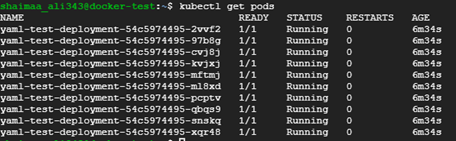

   Figure 7.7: Pod replicas created after updating and re-applying the YAML file

12. Each of these pods is an object in itself, but there&#39;s another object called replicaset that encapsulate them, and we can view that object using the command
  
   `$ kubectl get replicaset`

   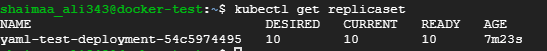

   Figure 7.8: Example replicaset object

What happens if we have a new version of the application and want to update the deployment? Using Kubernetes made it easy to make frequent/continuous updates just like it made it easy to deploy and scale the applications in the first place. We&#39;ll see some examples of implementing CD strategies using Kubernetes below.

## 7.3.2 Rolling Deployment Strategy

In the rolling deployment strategy, the replicas of the application deployments are gradually replaced by replicas with the new version to avoid having to shut down the application completely and to give us a chance to pause or rollback if any problem happens.

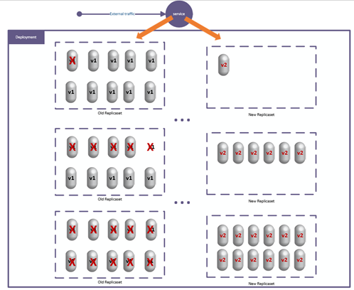

Figure 7.9: Rolling Deployment Strategy

This is the default updating strategy in Kubernetes deployment, so if we just update the container&#39;s template by changing the version number of the image, a rolling update will automatically be started.

### Exercise 2: Rolling Deployments using Kubernetes

- To update the application&#39;s version, we&#39;ll need to update the container template of the deployment. While we&#39;re at it, let&#39;s increase the number of replicas to 100 so that we can see the rolling effect. So the YAML file of the deployment should look like listing 7.4.

    ```
    apiVersion: apps/v1
    kind: Deployment
    metadata:
        name: yaml-test-deployment
    spec:
        selector:
            matchLabels:
                app: hello-i-am-here
        replicas: 100
        template:
            metadata:
                name: yaml-test-pod
                labels:
                    app: hello-i-am-here
            spec:
                containers:
                    - name: yaml-test-container
                      image: shaimaaali/hello-i-am-here:v2
                      ports:
                          - containerPort: 8080
    ```
Listing 7.4 Updated YAML deployment

- Issue the command `kubectl apply -f test-deployment.yaml` so that the change will take place then the kubectl get replicaset command multiple times to see the gradual rolling update while it&#39;s happening, as shown in the figure.
   1. It starts by creating a new replicaset with some replicas that contain the new version.
   2. Gradually shutdown the replicas with the old version as new replicas become ready.
      
      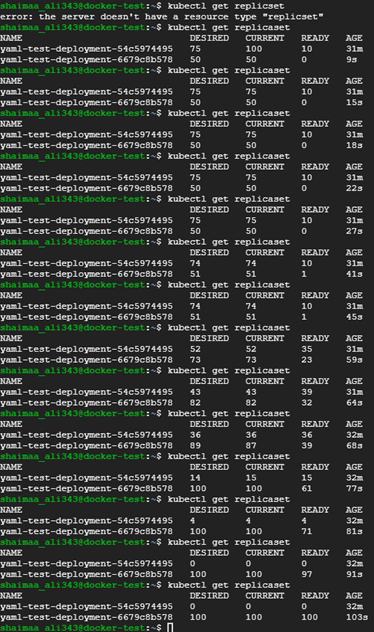

      Figure 7.10: Rolling Deployment Update with Kubernetes

   3. If you send requests to the service while the rolling is taking place, you may get different responses (i.e. from different versions) as replicas of both versions are still running.
   4. You can pause and resume the rollout using the commands

        `kubectl rollout pause deployment <deployment-name>` and `kubectl rollout resume deployment <deployment-name>`

      which would be very helpful if we want to perform extra tests or investigate any suspicious behaviour in the new version.

   5. If you&#39;d like to go back to the previous version, you can just issue the command

        `kubectl rollout undo deployment <deployment-name>`

        And you&#39;ll see the number of replicas in the old replicaset (with the old version) gradually increasing while the number of replicas in the new replicaset will gradually decrease.

   6. Let&#39;s delete this deployment as a clean-up step before we look at the next strategy using the command 
   
      `kubectl delete deployment <deployment-name>`

   7. We don&#39;t have to delete or recreate the service as it can still be used with the new deployments that we&#39;ll create in the next exercise.
## 7.3.3 Canary Deployment Strategy

The Canary deployment strategy is similar to the rolling deployment in that both would gradually replace the old version while monitoring the behaviour of the new version. However, you can have more control over the gradual update with the canary deployment.

In order to gain that control over the replacement of the old version with Kubernetes deployments, we can create a separate deployment under the same service.

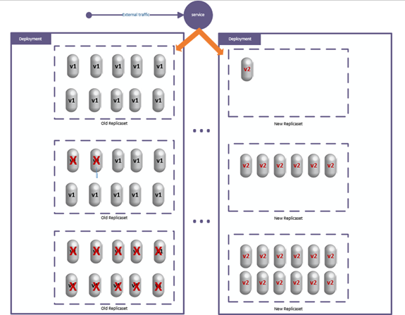

Figure 7.11: Canary Deployment Strategy

When we created the service in listing 7.2, we specified the selector of the pods based on the app label. If we use the same label when we specify the new deployment, the pods of that new deployment will be selected by the service and get some of the requests directed to them, just like the pods in the original deployment.

In the following exercise, we&#39;ll practice creating a canary deployment to update our hello-i-am-here application.

### Exercise 3: Canary deployment using Kubernetes

1. Here&#39;s an example benefit of creating the deployment based on a file as opposed to using direct commands. We want to create a similar deployment configuration (except for the version of the container image), so we can just copy the file of the original deployment and make specific changes to it. I&#39;ll also change the name of the original deployment (as well as the file name) to be more representative

    `$ mv test-deployment.yaml original-deployment.yaml` (renames the file original file)

    `$ cp original-deployment.yaml canary-deployment.yaml` (creates a new copy of the fil)

2. Edit the files so that their content would be as shown in the table below. As you can see, we can specify the number of replicas in both deployments as we wish. I chose to reduce the original replicas to 75 and to give 25 replicas with the new version.
      ```
      apiVersion: apps/v1
      kind: Deployment
      metadata:
          name: original-deployment
      spec:
          selector:
              matchLabels:
                  app: hello-i-am-here
          replicas: 75
          template:
              metadata:
                  name: yaml-test-pod
                  labels:
                      app: hello-i-am-here
              spec:
                  containers:
                      - name: yaml-test-container
                        image: shaimaaali/hello-i-am-here:v1
                        ports:
                            - containerPort: 8080
      ```
      Listing 7.5: original-deployment.yaml

      ```
      apiVersion: apps/v1
      kind: Deployment
      metadata:
          name: canary-deployment
      spec:
          selector:
              matchLabels:
                  app: hello-i-am-here
          replicas: 25
          template:
              metadata:
                  name: yaml-test-pod
                  labels:
                      app: hello-i-am-here
              spec:
                  containers:
                      - name: yaml-test-container
                        image: shaimaaali/hello-i-am-here:v2
                        ports:
                            - containerPort: 8080
      ```
      Listing 7.6: canary-deployment.yaml

3. After creating the new deployments, we can see that the old service is still able to direct requests to replicas in both deployments, and we can experiment with the new version to make sure that everything is going as expected and make adjustments as we see fit until we are entirely comfortable with eliminating the old version altogether.

   

   Figure 7.11: Example Canary Deployment using Kubernetes

## 7.3.4 Blue-Green Deployment Strategy

In the blue-green strategy, the old deployment would be labelled &#39;blue&#39; the new version would be deployed in a similar-sized deployment labelled &quot;green&quot;. The service that exposes the application will be directed to the green deployment for testing. If any problem is identified with the green deployment and we need to roll back, we can just change the service to direct the traffic towards the blue deployment.

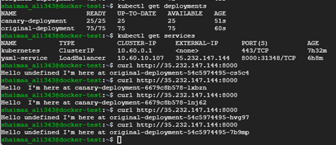

Figure 7.12: Blue-Green Deployment Strategy

# 7.4 Summary

In this chapter, we introduced the DevOps approach of managing the IT/Maintainance cycle as opposed to the traditional approach. We also described the continuous integration/continuous deployment (CI/CD) pipelines and how cloud computing contributed to the DevOps culture&#39;s popularity. Finally, we described three popular CD strategies with example implementations using GKE.
# Relevant lab\(s\) on Qwicklabs 

- [Implement DevOps in Google Cloud: Challenge Lab](https://www.qwiklabs.com/focuses/13287?catalog_rank=%7B%22rank%22%3A9%2C%22num_filters%22%3A1%2C%22has_search%22%3Atrue%7D&parent=catalog&search_id=15017341)
- [Deploy to Kubernetes in Google Cloud: Challenge Lab](https://www.qwiklabs.com/focuses/10457?parent=catalog)
# Image Credits

Unless otherwise stated, all images in this chapter were created by the author Shaimaa Ali using either MS PowerPoint or MS Visio or both. Code screenshot made using MS VSCode.

© Shaimaa Ali 2022
