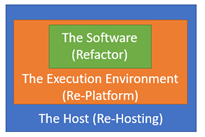
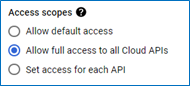
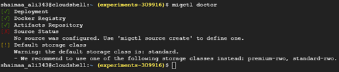
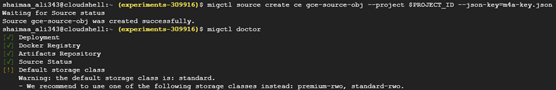
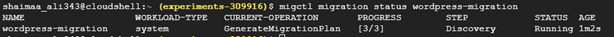
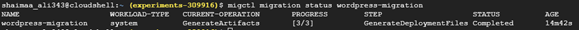
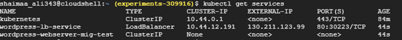
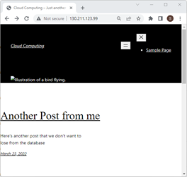
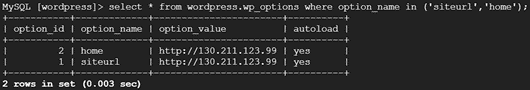
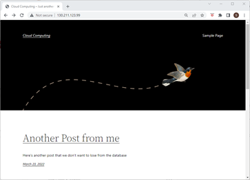

# **Chapter 9: Cloud Migration**
# 9.1 Learning Outcomes

By the end of this chapter the reader should be able to:
- Recognize the concept of Cloud Migration
- Recognize a general migration process
- Recognize the common migration strategies
- Use migctl tool to perform VM migration

# 9.2 Introduction

In the previous chapters, we&#39;ve discussed the different options of deploying a software system to the cloud for the first time and later updating it. However, it&#39;s common that a software system is already deployed and in use before a need (or an opportunity) to migrate (move) it to the cloud arises. This migration can be from a traditional on-premises deployment or another cloud deployment. In this case, additional factors need to be taken into consideration.

In this chapter, we&#39;ll discuss the general process of migrating software system(s) to the cloud, the different strategies that can be used, and we&#39;ll migrate our WordPress application that we deployed in chapter 4 to a Kubernetes cluster as an example.

# 9.3 Migration process

The figure below summarizes a general migration process with seven phases that start with identifying a reason for the migration to be considered and end with monitoring the new deployment. We&#39;ll discuss each of these phases below.


Figure 9.1: A General Migration Process

## Identifying a need or an opportunity

Any change in a running system involves a cost to investigate, plan and execute the change and an inevitable risk. So, unless there&#39;s a good reason for the change, most leaders would prefer not to take the risk. However, the case for migration has been increasingly evident, especially after the pandemic. Even before the pandemic, the benefits of using cloud technologies have been proven repeatedly by the increasing adoption.

So, in most situations, the case for cloud technology has already been made. However, it&#39;s not always the best idea, and not all systems are suitable for a cloud deployment. So, an analysis phase is needed to make an informed decision about the migration.

## Landscape Analysis

Big enterprises use multiple software systems to operate. For example, a university would have a Registration System, an HR system, a learning management system, a research support system … etc.

Those systems/subsystems constitute what&#39;s often referred to as the technology landscape. Each of these systems would need to be evaluated to determine whether it&#39;s suitable for the cloud and whether a return on investment (ROI) would make it worthwhile to make the move.

In addition to that, the complexity and risk involved in the migration need to be carefully considered as well.

A tool like [StratoZone](https://cloud.google.com/migrate/stratozone/docs/about-stratozone) can help automate several aspects of that analysis.

## Allocating migration strategies

In 2011 the research and consultancy institute [Gartner](https://www.gartner.com/en) identified four strategies commonly used for migration that started with R and called them the 4Rs mental model. Amazon adopted this mental model and added two more strategies, so now we have the [6Rs mental models for migration strategies](https://aws.amazon.com/blogs/enterprise-strategy/6-strategies-for-migrating-applications-to-the-cloud/). These strategies are described below.

- **Retain;** When the system is better left as-is, either because of the high risk or complexity involved in migrating it or simply because it&#39;s not suitable for cloud adoption.
- **Retire;** When the system is no longer needed, and it can be discarded altogether.
- **Re-purchase/Replace;** When a cloud-based alternative already exists and is available through SaaS. In this case, we only need to migrate the data from the replaced system to the new one.
- **Rehost;** When the system itself and its execution environment are suitable for the cloud. All we need to do is change the host into a cloud host like a VM instance or a Kubernetes cluster.
- **Re-platform;** When we need to change something about the execution environment before moving the system to the cloud (e.g. containerization).
- **Refactor;** When the system itself needs to be refactored (e.g. breaking down the monolithic application into microservices) before moving it to the cloud.

The figure below summarizes the three strategies that require some change in the system.



Figure 9.2: Refactor, Replatform and Rehost Strategies

We can allocate the most suitable strategy for each system based on the landscape analysis.

## Plan/Design for the execution

If multiple systems were found to be suitable for the cloud, then they need to be prioritized, and a careful plan needs to be created for the migration. It&#39;s recommended that teams that don&#39;t have experience with cloud migration start with the least complex system to focus on gaining expertise before moving to the complex ones. Other details about the migration need to be decided at this phase as well, like deciding on the provider(s), the automation tools that can be used, … etc.

## Execute the migration

In this phase, the actual execution takes place, including preparing the target destination on the cloud and moving the system to that destination.

## Validate

Like any software-related project, validation is an essential phase in which we ensure that the system is running as expected after the migration.

## Monitor

Finally, actively monitoring the migrated system helps identify and resolve any problems as soon as possible.

# 9.4 Migrating our WordPress Application

In Chapter 4, we deployed a WordPress web application using IaaS (GCE) for the webserver/middle-tier component and using PaaS (Cloud SQL) for the database component. Let&#39;s use that application to exercise working with migration.

### Identifying the need or opportunity

Even though that was a cloud deployment, we know now that containerization would be a much better option. Also, let&#39;s say that the number of requests our application needs to serve varies over time, and we would like to utilize the flexibility provided by Kubernetes orchestration.

### Analysis of the technology landscape

Even though we have one application, we would like to go more granular and evaluate the system&#39;s two components separately.

After monitoring the performance of the database component, we realized that it&#39;s coping well with the change in demand. Also, since this is the first migration, it&#39;s too risky to tamper with the data at the moment, so we&#39;d rather keep the database component as-is.

The webserver/middle-tier component is the one that is problematic in terms of coping with the demand, and it&#39;s not as risky as losing our data.

### Decide on a migration strategy based on the evaluation

Based on the analysis, we decided to **Retain** the database component. For the webserver component, we&#39;ll need to **Re-platform** to encapsulate it in a Docker container image and then **Re-host** it on a Kubernetes cluster.

### Plan/Design for the execution

[Migrate for Anthos](https://cloud.google.com/migrate/anthos)(M4A) is a great tool to automate many of the steps that we need to do. For a real migration, the planning step would include more project management activities, like timelines and role/responsibility assignments … etc. However, in this exercise, we&#39;ll focus on the technical plan.

1. Install migctl or use Cloud shell where it&#39;s already installed
2. Create a service account to allow migctl to access the resources needed for the migration
3. Create the Kubernetes clusters with node configurations that match the configurations of our webserver VM.
4. Install &quot;Migrate for Anthos&quot; on the cluster
5. Create a _**source object**_ that can be used with the Google Compute Engine instance.
6. Create a _**migration object**_ for the webserver VM
   1. The migration object will use the source object to scan the VM and create a migration plan
   2. The plan can be downloaded for review and/or update.
7. Once the migration object is done creating the plan, we can use it to generate the migration _**artifacts**_, including the YAML specifications for the Kubernetes objects needed for the re-deployment of the application.
8. Add a LoadBalnacer service object to the specifications.
9. Use the apply command to create those objects on the Kubernetes Cluster.
10. This step is specific to WordPress, as it stores the site&#39;s IP address in the database, so we&#39;ll need to replace the old IP address with the external IP of the new LoadBlanancer.

### Execute the migration

1. Preparation
   1. Stop the GCE instance and open its details page for editing.
   2. Go to the Access scopes section and choose &#39;Allow full access to all Cloud APIs&#39;, then save.

      

   3. Enable Cloud Resource Manager API because we&#39;re going to need it later.
   4. Open a Cloud Shell terminal to use as the control station.
   5. We&#39;ll need to refer to the project ID several times for the migration commands so it would be convenient to store it in an environment variable using the command

    `$ export PROJECT_ID=<your-project-id>`

   6. In order to allow Migrate for Anthos to use our cloud resources, we need to create a service account, grant it the required privileges, and download the key for that account in a file to be used later.
       1. The command to create the service account is:

          `$ gcloud iam service-accounts create <account-name> --project=$PROJECT_ID`

          so if I&#39;m going to use the &#39;m4a-service-account&#39; as the name, the command should look like this

          `$ gcloud iam service-accounts create m4a-service-account --project=$PROJECT_ID`

          after the account is created, we can refer to it later using the email address with the format

          `<service-account-name>@<Project-ID>.iam.gserviceaccount.com`

          might as well store this value in an environment variable to make it easier to reference later. I&#39;ll name the variable m4a-sa

          `export m4a_sa=m4a-service-account@$PROJECT_ID.iam.gserviceaccount.com` 

     2. We can download the key for this account into a json file using the following command
      
        ```
        $ gcloud iam service-accounts keys create m4a-key.json --iam-account=$m4a_sa \
          > --project=$PROJECT_ID
        ```
2. Creating the cluster
   1. We&#39;ll need to create the cluster with nodes that match the configuration of our webserver VM, but since we&#39;ve already used the default settings, we don&#39;t need to worry about the machine type. We just need to configure the project, the zone and the subnetwork using the following command

    ```
      $ gcloud container clusters create migration-cluster --project=$PROJECT_ID \
      > --zone=us-central1-a --num-nodes 3 \
      > --subnetwork "projects/$PROJECT_ID/regions/us-central1/subnetworks/default"
    ```
   2. Download the cluster&#39;s credentials to be able to access it later:

      `$ gcloud container clusters get-credentials migration-cluster --zone us-central1-a`

3. Installing Migrate for Anthos on the cluster
   1. First, we&#39;ll need to grant the service account access to the container registry and the storage services by creating a policy that links the service account to the role storage.admin using the following command

    ```
      $ gcloud projects add-iam-policy-binding $PROJECT_ID \
      > --member="serviceAccount:$m4a\_sa" --role="roles/storage.admin"
    ```
   2. Now, we need to use the migctl command-line tool to start the installation using the key of the service account that we&#39;ve prepared

      `$ migctl setup install --json-key=m4a-key.json`
  
   3. You can check the installation using the command $migctl doctor; it may take a while before the installation is complete; just keep checking until you see the first three items with a green check. As you can see in the figure below, the source status is not configured yet. We&#39;ll take care of that in the next set of steps

      

4. Create an m4a source object that can be linked to a GCE instance
   1. Grant the service account the ability to view the GCE instance and access its storage by creating a policy binding that connects the service account to the compute.viewer role and the compute.storageAdmin role

      ```
        $ gcloud projects add-iam-policy-binding $PROJECT_ID \
        > --member="serviceAccount:$m4a_sa" --role="roles/compute.viewer"
      ```
      ```
        $ gcloud projects add-iam-policy-binding $PROJECT_ID \
        > --member="serviceAccount:$m4a_sa" --role="roles/compute.storageAdmin"
      ```
   2. Now we can create a compute engine (ce) source object using the key of the service account

      ```  
        $ migctl source create ce <object-name> --project $PROJECT_ID \
        > --json-key=m4a-key.json
      ```
      so if I&#39;m going to name this object gce-source-obj the command should look like this:

      ```
        $ migctl source create ce gce-source-obj --project $PROJECT_ID \
        > --json-key=m4a-key.json
      ```

   3. After the source object is create, we can see that the source status is now checked
    
      

5. Create the m4a migration object that uses the source object to access our webserver instance with the intent to use it as an image for the installation
   1. The command to create the migration object is
      ```
        $ migctl migration create wordpress-migration \
        > --source <name-of-source-object> --vm-id <name-of-gce> --intent Image
      ```

      ```
        $ migctl migration create wordpress-migration \
        > --source gce-source-obj --vm-id wordpress-webserver --intent Image
      ```

   2. Keep checking the object&#39;s status using the command below until it&#39;s ready.

      `$ migctl migration status wordpress-migration`

      

   3. A migration plan is automatically created and ready to use. We can download it as a YAML file using the command 
   
      `$ migctl migration get wordpress-migration`

   4. If we would like to customize the migration plan, we can just edit that file then upload it to m4a using the command 
   
      `$ migctl migration update wordpress-migration`

6. Create the migration artifacts
   1. By asking m4a to create the artifacts based on the generated plan
   
      `$ migctl migration generate-artifacts wordpress-migration`

   2. Again, keep checking the status until the artifacts are ready

      `$ migctl migration status wordpress-migration`

      

   3. Download the generated artifacts using the following command

      `$ migctl migration get-artifacts wordpress-migration`

   4. The artifacts generated include the Dockerfile to create the image and a YAML (deployment\_spec.yaml) file to describe the configuration for the Kubernetes deployment and service objects

7. Add a load balancer service to the YAML specifications
   1. Here&#39;s one new thing to learn about YAML, we can specify multiple objects in the same file separated by a line with three dashes (---)
   2. Open the deployment\_spec.yaml in an editor like vi and add the following service object specifications to it

      ```
      apiVersion: v1
      kind: Service
      metadata:
        name: wordpress-lb-service
      spec:
        selector:
          app: wordpress-webserver
        ports:
          - protocol: TCP
            port: 80
            targetPort: 80
        type: LoadBalancer
      ```

8. The Kubrentes deployment
   1. Execute the deployment using the `$ kubect apply -f deployment_spec.yaml`
   2. Wait for the external-ip to be generated, then send an HTTP request to it to see the new deployment

      

   3. Start the database server and send an HTTP request to the external IP address.
   4. You should be able to see the WordPress home page. However, the picture is missing, the format is off, and if you click on any link, you&#39;ll get a TIME\_OUT error as the requests from the links will be sent to the old IP address stored in the database.

      

9. We can fix this by updating the value of the site&#39;s IP in the database. We need to access the database from a client in order to update the data. We can use the MySQL client that we installed on the wordpress-webserver instance.
   1. Start the wordpress-webserver VM instance.
   2. Open an SSH connection to the instance
   3. Connect to the DB server through the client

      `$ mysql -h <ip-of-the-sql-instance> -u wordpress --password=<wordpress-client-user>`

   4. Switch to the WordPress database schema

      `MySQL [(none)]> use wordpress`

   5. Update the IP value in the wordpress.wp\_options
    
      ```
        MySQL [(wordpress)]> update wordpress.wp_options
                                  set option_value = '<LoadBalancer IP>'
                                  where option_name in ('siteurl','home');
        commit;
      ```
   6. Verify that the values were updated by selecting the rows we just updated
   
      `MySQL [wordpress]> select * from wordpress.wp_options where option_name in ('siteurl','home');`

      

   7. Now, if we send a request to that IP, we should be able to see a properly functioning application.

      

10. Since our application is now deployed on a Kubernetes cluster, we can utilize all the cool features of Kubernetes like scaling up or down the replicas, as we&#39;ve learned before. Right now, there&#39;s only one pod in the deployment, but we can scale it to any number that we want either by changing the deployment\_spec.yaml or by using the kubectl scale deployment command

   `$ kubectl scale deployment wordpress-webserver-mig-test --replicas=10`

# 9.5 Summary

In this chapter, we discussed the concepts related to cloud migration, including the general process and the common strategies used for different systems. For the Hands-On component of the chapter, we migrated the WordPress application that we deployed in chapter 4 to a Kubernetes cluster using migctl tool.

# Image Credits

[GCP Screenshots] &quot;Google and the Google logo are registered trademarks of Google LLC, used with permission.&quot;

Unless otherwise stated, all images in this chapter were created by the author Shaimaa Ali using either MS PowerPoint or MS Visio or both. Code screenshot made using MS VSCode.

© Shaimaa Ali 2022