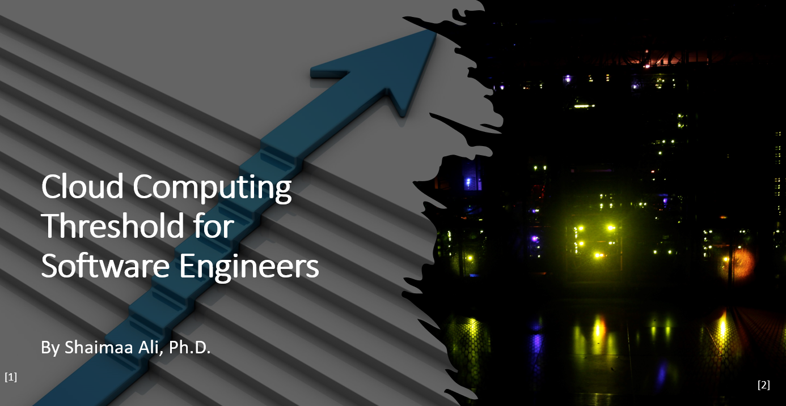

# Table of Content

[Preface](./Preface.md)

[Chapter 1: Introduction](./Content/Ch1-Introduction.md)

[Chapter 2: The Basics](./Content/Ch2-TheBasics.md)

[Chapter 3: Architecture Design for Cloud Applications](./Content/Ch3-Architecture.md)

[Chapter 4: IaaS and PaaS Deployments](.Content/Ch4-IaaSandPaaS.md)

[Chapter 5: Introduction to Containerization](./Content/Ch5-Containerization.md)

[Chapter 6: Container-based Deployments using Kubernetes Orchestration](./Content/Ch6-Orchesteration.md)

[Chapter 7: DevOps and Cloud Deploymnets](./Content/Ch7-DevOps.md)

[Chapter 8: Serverless Deployments](./Content/Ch8-Serverless.md)

[Chapter 9: Cloud Migration](./Content/Ch9-Migration.md)

[Bibliography](./Content/Bibliography.md)

#### Cover Image Citations

[1] Image generated by the design ideas module of MS PowerPoint

[2] "Datacenter @ Night unblinded" by Arthur40A is licensed under CC BY-SA 2.0,modified by the author using PowerPoint